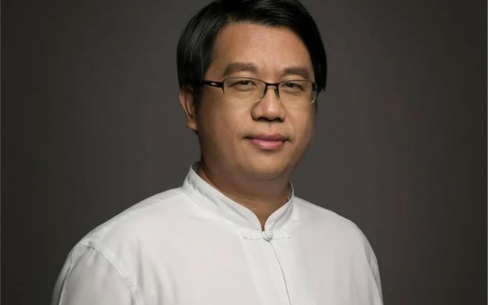

---
---

# 吕世浩历史讲座
#books 
## 基本信息

图片::http://i1.hdslb.com/bfs/archive/6e381df787e06b47558065e241c4efceead4be7e.jpg
作者:: 
出版社:: 
出版年:: 
页数:: 
定价:: 
装帧:: 
ISBN:: 9787020114665  
个人评分::⭐⭐⭐⭐  
阅读日期::2021年

## 摘抄笔记

努力找寻智慧，接近有智慧的人，难，你不一定知道谁有智慧，因为大智若愚，不一定遇到，也不一定愿意教你。因为有智慧的人怎么会跟没智慧的人交朋友。二是读有智慧的书。
书读百遍，你的收获，跟你下的功夫有关。
好好观察自己能做什么，你就是你终身学习的对象，自试，自己为什么高兴、难过、生气，自己发现不足了才会思考。先把生命中的不足找出来。想要自强，首先不自欺，勇敢面对自己的不足。

史学讲究疑则传疑，对不确定的史料努力的传承下去，忠实的记载下去，让后世去判断。

多读有智慧的书，其中蕴含着作者的某种责任。
为什么人们都喜欢英雄，喜欢情绪的宣泄，因为我们是凡人，正因为如此，智者与凡人不同，就看你想做智者还是凡人。如果你做一个智者，别人怎么做跟你有什么关系，你如果做一个凡人，别人这么做又有什么好奇怪的呢。
可以淡的人你没淡，则失人，不可以淡的人你淡了，则失言。一个人只靠坚持，不一定成功，必需要智慧。
每个人有不同的目的，达到的效果不一样。
旧时代的东西不一定照搬，但有很多智慧需要我们学习。
解答你生命中的问题，靠辩论不一定得到答案，要自己去体会。
《史记》这门课是帮助你了解史记在说什么，《伯夷列传》那是太史公的答案，作为参考，要寻找自己的答案，先要了解作者的观点，不要浅浅的看书，直接来问，《学习中国书应有的态度》

我的想法跟很多人不一样。很早知道生命中有不完满的地方，找到自己生命中需要什么，人必须有不足，才能继续往前走。

白话是翻译者的意思，读原文，找好注本，做自己生命的领袖。孔子是中国历史上最伟大的人物，没有之一。

读史书要参考前人的智慧，贵精不贵多。
君子可以欺之以方。要做到不贪，不能用侥幸心理去追求不该你得到的东西。
不重视答案，要重视思考的过程。

什么是有智慧的书。每个人的背景、环境都不一样，参考前人的说法。

凌烟功臣少颜色，将军下笔开生面

中国人几千年来都在研究人，累积了上从帝王将相，下至贩夫走卒，大量的人事资料，因为中国人认为，所有事情的关键在于人，制度对了，方法对了，只要人不一样，结果可能天差地远，这就是中国史学独特的观点。

你人生想要什么，得到了就是成功，得孙到就感觉不成功。

希望学习历史怎么思辨，【博学之，慎思之，审问之，明辨之，笃行之】需要审问

现在对下一代的教育，从胎教开始已经太晚了。中国古代对孩子的教育，从挑选另一半的基因就开始了。一代文明需要比一代强。

我们在认人的时候常有三个毛病，一是不知人，二是不自知，三是既不知人也不自知。

学习历史的方式有巨大的改变，训练各种工匠，对于技术性学科可以，而人文学不行。古代的人不像现在学习方式，他们不关心事件发生的时间、地点、原因，他们更关心能从这件事中学到什么启发，

孙子兵法告诉你，胜者先胜而后求战。发动一场战争的原因只能是，我能打赢。

==忍得住，收得了。在所有人都想到“进”的时候，你想到“退”，这就是“先”==

不要相信“三个臭皮匠赛过诸葛亮”。你找什么样的人共谋，就会产生什么样的结果。怎么挑共谋的人？要可以信得过，才智够高，最重要的，思维方式不能与你完全一样。

做事之前要想清楚各种方案，预估各种可能出现的情况并想好如何应对。
智者想事，未虑胜先虑败。猷，就是止损点。要想清楚自己能承受到多大程度的损失，你愿意付出多大代价。

这个人结束了长达五百年的战乱，秦朝凭什么？秦朝迅速灭亡，为什么？

曾经秦的人也得到名利，结果是什么？
真正喜欢什么就读什么，要读懂，读通，而不在多。「通」和「透」不同，「通」是这个道理你觉得你想清楚了，「透」是你有一天突然拍桌大喊「原来如此！」那就是透。碰到事情，必须想到透的地步。

人要怎么抓住机会？人生想要改变，改变从哪里开始。

用人最好的办法，就是给他三个东西，恩义，情义和理想，三管齐下。说服别人最好的方法，就是站在对方的立场去思考。为他的利益着想，帮他解决掉所有困难，他就会乖乖为你所用。

了解人性，审时度势。看清楚别人要什么和他畏惧什么，就可以让他为你所用。

你生命中的标准答案只有你自己能找出，人生最重要的东西就是找到自己需要什么，这一生才是值得的，这个问题可能自答、自证、自知。你人生是成功还是失败，只有你自己才能印证，别人说什么都没有用。扪心自问只有自己才有答案。
别人的答案只能给你参考，跟别人辩论有什么益处，辩赢了又怎么样呢？

学历史的两个大功用，第一是启发智慧，第二是了解人性。社会是人的组成，想成功，就必须了解人性。而了解人最好的方法，就是藉由人事案例，这也是中国史学价值之所在

人世间不是只有理，还讲情。「情」主导了大部分的决定，是最值得重视、也最麻烦的东西。

中国人看事情认为事情必有阴阳、表里、正反两面。看事情不但要看表，还要看里，要看他没有说出来的那一面到底是什么，到这个地步你才真正明白什么是人，什么是事。

荀子说，「百王之无变，足以为道贯。」道贯的意思就是人性。我教历史会不断发出各式各样的问题，要你盖上书，仔细去想，在这一刻你会怎么做，你才知道千古以来的人性会做出什么样的选择。就像人性多贪，如果你遇到一个不贪的人，通常是因为那个东西他不想要，他想要别的，只是贪的东西不一样

明白了人性之后，你还要有审时度势的智慧。这个时代的环境就是「时」，趋势就是「势」，任何人都不可能和时势作对。你要明白时代会往哪个方向推演，这是学历史最重要的事情。我最常问学生，我们到底活在什么样的时代，这个时代的人的特色是什么，你才会明白这个时代做什么容易失败，做什么容易成功。

不过，他的前半生也有值得参考的地方，那就是，人要成功，必先把理智放在感情之上。简单来说，感情是我喜欢做什么，我不喜欢做什么；理智是，我能做什么和我不能做什么。
像秦始皇这种情感强烈的人，你去讲他的心结，他理智上发现对他有利，他就能用理智去压抑感情，做出正确的决定。相较于对峙500年的战国时代，秦始皇不过花了几年就统一天下。领导者碰到事情必定要先问自己，你是用理智做决定，还是用感情做决定？

取天下需要有能力的功臣，守天下要靠人品好的社稷臣

因为取天下（创业）需要功臣，看的是能力；守天下（守业）则需要社稷臣，看的是人品。

历史上都告诉你要「亲贤臣、远小人」，因为小人很好用，善用小人，成功可以比你想的快很多，你要100分，小人可以做到120分。但是为什么不能用小人？因为只要有利可图，小人将来一定会反咬主人。秦始皇用的是像李斯这样的人，他是功臣，不是社稷臣。

用人要看三件事，最重要的是「人品」，人品不好但能力强，将来必要反咬主人，对组织有不良影响。第二是「态度」，态度决定成败。第三才是「能力」，人品不佳、态度不好，可是能力很强，将来就会破坏组织长久经营。

秦始皇看的全部都是能力，当年他的祖先秦穆公遭遇惨败，立誓告诫子孙，若看到别人有才能，不让他出头，这样的人就是对国家有害的人，将带来危险。李斯为了自己出头，害死师弟韩非，这不就是秦穆公警告绝不能用的人吗？但是秦始皇没有听从祖先誓言，李斯有才华，秦始皇就重用他一辈子，最后李斯背叛了他，还害死了他的继承人扶苏，三年之后，秦始皇建下的王朝就灰飞湮灭了。

任何人都不会想象秦始皇一样快速成功失败，问题只在于你有没有心去追求长久之道。中国文化看的不是眼前，而是长久，中国人自有一套长治久安的办法，这就是中国历史智慧之所在。而要看长久，就必须思考自己希望带给下一代什么样的世界，又造就了下一代什么样的世界。
没有实力，所有的东西都只是暂时替别人保管而已，

国学知识没有意义，思维模式才有意义。如果我是他，会怎么做，从历史人物的做法中学到什么东西。

中国无数对悲剧的父子 ：父不知父，子不知父。相爱如果不能相知，注定以悲剧收场。并不了解对方。

礼记中记载，鲁哀公问孔子，天地间什么礼最大，答婚礼。

古人认为，婚姻的目的是家族的传承。

智慧从来不在新旧，用对地方就是好智慧

同样的药，有人拿来帮助吴王灭了一个国家，有人拿来洗衣服，有人能攥十金，有人能获得一座城。

所有的学问，能解题才叫智慧，不能解题没有任何意义。

为什么晋献公没有发现百里奚的才能。【当是时，百里奚年已七十余】企业征人不会征高龄的人。秦国求贤若渴。秦穆公立即与语国事（私下聊），百里奚谢绝，秦穆公说国家灭亡不是你的错，而是君王的错，不知道用你。

中国人谈话，情在理先。
曾国藩教孩子写字。【吾儿天资胜吾十倍】情才是一个家庭的本质。利才是事业的本质，做事业最终为了赚钱。本末倒置，结果只能误人误己。

当受到秦穆公礼遇，向秦穆公推荐蹇叔，一是恩人，二是朋友，讲了几个案例，证明蹇叔的才能。

一个人有才华，最遗憾的是怀才不遇，百里奚已经七十了，不能等了。秦穆公厚币延蹇叔。
为什么百里奚推荐比自己能力强的蹇叔？今天人的思维是碎片化的，古代人的思维是系统的。
中国人认为万事万物都有阴阳两面。人本来有不同的面目。从道德和利害的两面考虑。蹇叔与百里奚是恩人，秦穆公需要人才，蹇叔又是自己的恩人，从忠、义角度都需要推荐蹇叔。从利害考量，蹇叔在，百里奚这一刻是外国人，空降到秦国，掌握大权，他四面受敌，百里奚七十岁获得大位，成功靠什么，人未必都跟你一条心，要成功最重要的是关键位置上要有自己人。这时正是向秦穆公推荐蹇叔。从道德和利害两个角度考虑，如果一致的话，肯定是最好的策略。

晋献公死，骊姬作乱，晋国乱，逃亡在外的夷吾请求秦穆公送他回去，夷吾许诺割河西之地与秦，事成后夷吾翻脸，十二年，晋国发生旱灾，向秦国请求粮食，百里奚说：旱灾不会使晋国国君饿死，老百姓反而受灾，秦穆公决定援助。十四年，秦国受灾，请求晋国支援，晋国趁机攻打秦国，秦穆公亲征迎战，夷吾跌马，秦穆公欲抓夷吾，反被晋军围困，此危亡时刻，七百野人出来助战。此野人曾偷国君的马，官员抓住欲正法，秦穆公说【君子不以毫不以畜产害人】，决定赦免他们，我听说吃好马肉不喝酒对胃不好，又送了好酒给他们。这次秦晋开战，野人助穆公，人人欲推锋争死，为报答当年食马之德。
秦穆公援助晋国，晋国恩将仇报，援助野人，野人涌泉相报。好心真有好报吗？佛教放生团体，当你好心做好事时，如果想有好报，这本身就是投资行为。要看看历史记录啊，做事要有知人的智慧，做好事就不要望报了。
做任何事要问自己的本心。道家看透事情的本质和真相，真相很残酷，一般人不喜欢真相，很残酷，当换了很多发型都不好看时，应该考虑是不是脸的问题。
秦穆公抓住夷吾，打算作为牺牲祭天，周天子劝说，秦穆公的夫人是夷吾的姐姐，也来劝说，救自己的弟弟。秦穆公说【我得晋君以为功，今天子为请，夫人是忧】，于是决定与晋君结盟放他回去，这次夷吾履行盟约，割了河西之地，，派儿子到秦国做人质，秦晋恢复了友好关系。
秦穆公为什么成功？秦穆公想杀夷吾，但是不能意气用事，杀不能杀，会招致晋国报复，放不能放，没法给国人交代。这时候需要下台阶，可以化干戈为玉帛，这时周天子和夫人是最好的台阶。周天子赢得了脸面，穆公夫人救了弟弟，晋国人听到觉得夫人重情重义，秦穆公为什么成功，因为让所有跟你做事的人都能得到好处，这叫以德服人以后大家还会跟你干。
一般人以利服人，容易积怨于人，中等人以智慧服人，人家会对你心生防备，上等人以德服人。再上面，有做事不显山不露水。
二十年，秦灭梁。
身教重于言教，公子峪偷跑回晋国。秦国迎接另一个逃亡的公子重耳，重耳流亡十九年，到的小国，态度一般很恶劣，不欢迎他，因为小国国力弱，担心受到晋国报复，大国欢迎重耳，认为奇货可居。==人家对你的态度，取决于当时的需要和有用==跟他性格是否善良、你性格怎么样没神恶魔关系。贫在闹事无人问，不过是需要和有用。
楚国问重耳，你当上国君，你怎么报答我。重耳回答说：实在想不出怎么报答你。我想来，回晋国后，愿退避三舍以谢。这时可看出重耳的性格，在困境下，不放弃以国君自居，不肯牺牲晋国利益，这种人一旦有机会，就会强大，这就是今后的晋文公。

城濮之战，楚国大败，晋文公完成霸业。晋文公成功，最大的助力是秦国，晋国打算打郑国，拉秦国帮忙，郑国派烛之武退秦师，烛之武问秦君，帮助晋文公得到了什么好处，晋之强乃秦之忧也。秦穆公撤兵，晋文公召开会议，臣子建议攻打秦国，晋文公反对，实际上防备秦国，秦国两次插手晋国内政，晋国肯定防备它，干什么事都拉着秦国，因为你在后面我不放心，秦之强也是晋之忧。
郑文公一死，有间谍来告诉秦穆公，作为内应，帮秦军拿下郑国。蹇叔反对，穿越几个国家，劳师袭远，必败有人出卖郑国，也会有人出卖秦国。秦军出征，蹇叔哭师，你们的军队一定会惨败，必在崤山险恶处。过周，直接穿过周国国境，没有通知周天子，沿路的国家都直到你要奇袭，在滑地碰到了弦高，抓到就好，弦高急智，送牛犒劳秦军，三个将军认为事已泄，进不能进，退不能退，找下台阶，顺道灭了滑国，晋公子服丧期间，决定发兵在崤山埋伏，除三位将军外，秦军覆没。
秦穆公大败是必然，战前两位老人已经预言，败在崤山之厄。晋文公在世时最担心秦国，晋文公将死，肯定交代对付秦国的策略，最好的战争是在我好的时间，最好的地点，打我想打的战争。从头到尾，就是晋文公设的局。秦穆公因为晋文公的死，一个人被骗，是因为他贪，而不是因为笨。秦穆公三年后报仇，作《秦誓》，为秦亡人发丧，君子闻之，皆为垂涕。

中国人的智慧都是从历史中总结出的，通过一个个案例了解人性的本质，进一步推测时事未来。中国人的智慧本本质是了解人性，审时度势。

### 孙子兵法

有需要就要争讼，争之最大者就是师

忍是为了等待最好的时机

人生智慧很多，智慧领悟到了，明白了，可是做不到，为什么？舍不得，这个也想要，那个也想要，什么好处都是你的，哪有那种好事，做事必须付出代价。

如果领导不喜欢你，你越利害，他越会防范你，历史上有好结局的人不多，我们以世公论，不讲对后世的贡献，孔子是一位失宠的政客，老子是无业人物，庄子只会做梦，韩非被人毒死，商鞅被五马分尸，孙膑受膑刑，历史上这些人物在世功业只有两个人有好结局，管仲和孙武。上述说的那些人之所以不能用，因为他的时代有问题，那个时代不能用他那一套，这些人发是知其不可为而为之的人，所以才会有那样的结局。

尽信书不如无书。  
  
读书，是为了印证和扩展自己的内心，让书为我所用。而不是我被书用。

毓老师说：我是问心学派的，任何事，先问自己有愧无愧？有愧，就不要去做。永远无愧于心，无愧于师。

一个人能否成才，不取决于你上名校跟名师，而取决你的理想和执着于追求理想的精神。——刘道玉

