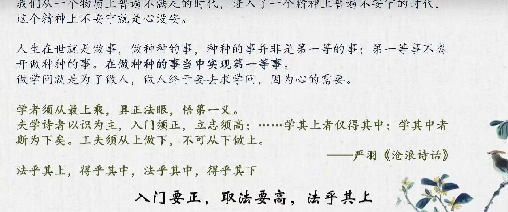
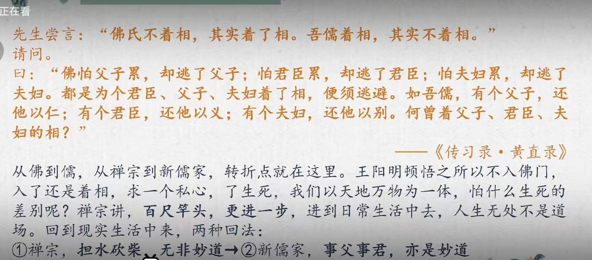

# 王德峰讲《传习录》
#books 
## 基本信息

图片::https://img1.doubanio.com/view/subject/l/public/s34103690.jpg
作者:: 王德峰
出版社:: 
出版年:: 2021年
页数:: 
定价:: 
装帧:: 
ISBN:: -
个人评分::⭐⭐⭐⭐⭐  
阅读日期::2023年

 [

## 摘抄笔记
[视频链接](https://www.bilibili.com/video/BV16Z4y147Ja/?spm_id_from=333.999.top_right_bar_window_default_collection.content.click&vd_source=9f96f031e3596867740cf42b32f534f4)

### 导言
人生第一等事：读书学做圣贤，发财当官属于副产品
人有五官，各司其职。耳听美乐，目看美景，口尝美味，必须有个主宰——心，而不是头脑。中国哲学的主题：如何安顿好我们的心。抓住我们的心，满足我们的心的是生命情感的发挥。这是人生的动力。心向往之才去行动起来。生命情感中有义理，心要得到满足。
人生在世需做种种事，做第一等事离不开做种种事，从做种种事中实现做第一等事。
做事首先是做人，做人就是学做圣贤。

喜看黄老者，喜趋利避害，低看儒家，认为是封建统治阶级的意识形态儒家实为安生立命、应事成功之学。王阳明说，每一个中国人，无论是贩夫走卒还是引车卖浆者流，都应该做收拾精神，自作主张的大英雄。
今日之中国，众人欲望忷忷，重功利，轻道义，视荣耻如无物。经济上表面的繁荣，资本做大，不足以成为国泰民安之根基。
我们至少有一个使命，守先待后，我们有一个不可推卸的责任，将中国文化最高境界传承下去，让他们知道怎么做人。不光是口上说，而是去实践。
《传习录》关键在于“习”字，做人的实践，生命的实践。
1.2 王阳明是儒家的慧能。
如何树立东方社会的人，他的勇敢、骨气、自信、高尚都从儒家立起来，今天的年轻人缺少基本信念，从王阳明心学中获取。
王阳明龙场悟道后，从本心功夫上指点，不落言荃，不拘概念，“教外别传，不立文字，直指人心，见性成佛”
王阳明，学凡三变，诗词歌赋——朱熹格物——出入于佛老之间——顿悟后致良知

夫妇还一个别，互相帮助，互相尊重。
禅宗讲百尺竿头，更进一步，回到现实中去，人生无处不是道场，两种回法①禅宗：担水砍柴，无非妙道。②儒家：事父事君，亦是妙道。对我们的亲人和民族承担起该承担的责任。
此心纯乎天理之极，极为标准。天道之极致，无非柴米油盐，即人道。待人接物，应对世事，要有一个纯乎天理的心，有大的才华做大的事情，有小的才华做小的事情，人人应该如此。
1.3传习录读法
一问一答式，恳切的问，真切的答。
实践是心之行也，交流也是实践。心是如何发动的，最根本是正心诚意，从诚意处看，不要从其他层面找原因。举例：酒后胡言乱语，是因为心中原有此意，只不过借酒发挥。从一问一答中体会王阳明的境界。
### 解读徐爱录

做第一等事，必须读《大学》。小时候要熟背。
《程子遗书》：大学，初学入德之门.

>先生于《大学》“格物”诸说，悉以旧本为正，盖先儒所谓误本者也。爱始闻而骇，既而疑，已而殚精竭思，参互错纵，以质于先生，然后知先生之说，若水之寒，若火之热，断断乎百世以俟圣人而不惑者也。先生明睿天授，然和乐坦易，不事边幅。人见其少时豪迈不羁，又尝泛滥于词章，出入二氏 之学，骤闻是说，皆目以为立异好奇，漫不省究。不知先生居夷三载 ，处困养静，精一 之功，固已超入圣域，粹然大中至正之归矣。

寒热为心之感受，心是理之灵，脱离人性的理叫僵死的教条。

大中至正
>爱问：“‘在亲民’，朱子谓当作‘新民’。后章‘作新民’ 之文似亦有据。先生以为宜从旧本作‘亲民’，亦有所据否？”先生曰：“‘作新民’之‘新’是自新之民，与‘在新民’之‘新’不同，此岂足为据？‘作’字却与‘亲’字相对，然非‘新’字义。下面‘治国平天下’处，皆于‘新’字无发明，如云‘君子贤其贤而亲其亲，小人乐其乐而利其利’；‘如保赤子’；‘民之所好好之，民之所恶恶之，此之谓民之父母’之类，皆是‘亲’字意。‘亲民’犹孟子‘亲亲仁民’之谓，亲之即仁之也。百姓不亲，舜使契为司徒，敬敷五教，所以亲之也。《尧典》‘克明峻德’便是‘明明德’。‘以亲九族’至‘平章’、‘协和’，便是‘亲民’，便是‘明明德于天下’。又如孔子言‘修己以安百姓’，‘修己’便是‘明明德’，‘安百姓’便是‘亲民’。说‘亲民’便是兼教养意，说‘新民’便觉偏了。”

新：即改造
明明德：到群众中去，不是在书斋中，

教师的第一要务不是教书，首先让学生作为人存在，而不是作为某种人而存在。
众人之行：民众的生命实践。圣人从领会体察众人的生命实践中来。圣人求道，道不可见，道在人民生活中。一阴一阳，既冲突又妥协，对立统一。

改革开放30周年大会上讲：不动摇、不折腾，说明有折腾
当今中国社会中种种矛盾困境，需要我们从生活中体察人民生活的需要：安居乐业。安居：对无产阶级来说买得起房，对资产阶级来说在国内呆得住，乐业：对无产阶级来说不失业，对资产阶级来说事业在国内有没有发展前途，是否需要转移到国外。

毛主席有两种思想，西方思想——改造国民、东方思想——百姓是真正的英雄，对百姓要如保赤子。"民之所好好之，民之所恶恶之"。文革把中国搞得翻天地覆，社会主义思想没有深入人心，反而把人与人的道德败坏了，这是毛主席最大的败笔。
邓小平提出“小康社会”，正是民之所好。

对亲人之外的人不叫亲，而是仁，地下矿产是国民物资生活的保证，不能轻易开采，即爱物。
一个人善的胸怀不是莫名来的，根源于亲亲。

最不能忍的是与秦人之间的亲情。文革时也出现短暂的政治团体，父子不是父子，夫妻不是夫妻。但不能长久，政治信仰的性质与宗教信仰不同，我们无法对政治的理念形成一个满足我们终极关怀的需要，文革后出现伤痕文学，由《伤痕》小说而来，回归家族。
孟子：亲民，仁之也。
#### 王门四句教
本体与功夫不能脱离，对思想史的研究与人民的生命实践无关。
传习录是一组一组的对话，所问恳切，所答真切。

讲求也是涵养功夫，没事时思考想想叫讲求，做事时叫涵养，这叫养气。讲求的根据在日常我们已有的涵养
##### 无善无恶心之体
做学问和生命实践不能二元对立，善与恶不能二元对立。慧能得了衣钵后，惠明要夺衣钵，慧能显神通，惠明说：“我不为衣来，我为法来”。慧能答：“不思善，不思恶”，超越善恶，人间很多纷争由于停留在二元对立上，而遗忘了事情的根本。“不思善，不思恶”，超越善恶的对立，佛法是不二法门，排除二元对立，
格物就是正物从竹子中体察竹子的理，后来幡然醒悟，格物致知不是向外求的，我们自身本自具足，也就是佛家所说的本心。

格物之“物”，不是物体，而是事情。格物即正物、正事，把事情本身的道理领悟到，天理与本心无二，良知是我们的心，乃是昭昭明觉处。理解“心之体”，从“吾心即宇宙，宇宙即吾心”，宇宙本无善恶，成群的白蚁毁房屋，人要灭它们，白蚁有善恶吗。
心的启用叫已来了，佛家讲念来了，有善有恶了，意念为体之用也。灯，灯泡为其本体，发光为其用，灯是光之体，光是灯之用，没有时间上的先后，心在意就在，感受到温暖，才体会到太阳的存在，因有太阳之体，才有阳光之用，==没有时间上的因果关系称为体用。==，有前因后果时间因素参与其中的不是体用关系。
佛学中国化引入了体用关系，构架了中国哲学与西方哲学之间的桥梁。体用是关键。

>常观金体，不睹众相——僧肇《宝藏论》

金子本身你看不到，看到的是金项链、金戒指，这是器物，器者用也。
我们在处理各种相的世界中活着，活在金碗、金项链的差别中，修佛就是把这个差别拿掉、扬弃掉
用有种种，智慧、烦恼是心的不同用法，烦恼和智慧同为心之体，就看怎么用，惠明的四句偈【时时勤拂拭，勿使惹尘埃】，把明镜台与灰尘对立起来，灰尘就是烦恼，现实世界叫尘世，到处是烦恼。烦恼来自心，惠明要“勤拂拭”，擦心，殊不知灰尘来自这个明镜般 的心，同出一元，烦恼戒，菩提出，烦恼即菩提。就看你心之体怎么起用。
##### 有善有恶意之动，知善知恶是良知

良知就是天理，知善知恶不仅仅是头脑中懂得，的功夫在格物、正事，每次都合适地做事。格物叫实践、做事。由体到意，由意到知，由知到格。格者正也。
恶为私心遮蔽，我们做功利的事情，失败了往往归咎于知识经验不足，兵法中常说“兵不厌诈”，实际上应是【用兵贵于诚】。彼此之间斗智，讲求三十六计，此末技而已。==你中了对方的计，根本上是你受到诱惑。==第一你不会上当的关键在于【诚】，你知道你有多大的实力，敌强我弱看清楚了，你以为可以侥幸吗。毛泽东讲求全局观念，全局上我是劣势，我可以在局部上变成优势，遥一个师吃掉一个营总可以吧。蒋介石说控制了5个城市就控制了中国，毛主席说谁赢得了农民，谁赢得天下。这就是“诚”。境界不同。
事先要正好，打仗如此，其它也一样。

为什么有新儒学，因为禅宗，由禅宗的体用关系，在体上用工夫，每一次用都是体的体现。修正修好的标准在哪里，意正意诚怎么看出来，从做事情上看出来，格物是诚意的功夫，诚意是体，格物是用，在做事情中诚意，“正其不正，使其正也”。王阳明每做一事，使其正也，

#### 徐爱跋

>爱因旧说汩没 ，始闻先生之教，实是骇愕不定，无入头处。其后闻之既久，渐知反身实践，然后始信先生之学为孔门嫡传，舍是皆傍蹊小径、断港绝河矣！如说**格物是诚意的工夫，明善是诚身的工夫，穷理是尽性的工夫，道问学是尊德性的工夫，博文是约礼的工夫，惟精是惟一的工夫**：诸如此类，始皆落落难合，其后思之既久，不觉手舞足蹈。

工夫即效用，需要实证，拿出实证来看看，即神通，见性成佛，摆脱时间和空间的限制。
儒家有另外的实证：齐家、治国、平天下。

修身不是修个体，==身为亲亲，与亲人的关系，齐家是修身的效用。==父子之间还之以仁，为人父母者，要以合适的方式与子女打交道，家风由此而出，父子关系需要身行示范。修身前需诚意正心，也不为父子名相所累。
收拾精神、自作主张，年轻的父母不是需要读育儿手册，而是修身。不能一味平等，该批评该批评，喜怒哀乐没错，发而皆中节。帮助孩子
说话本是一种行为，不要从字面上去领会，行为的深意你是可以领会的
醉酒之后打孩子，父不父，则子不子，这是习气本性使然。

从你知种种的理，即可知你尽性的工夫，把你做的事情、悟的道理讲出来，这就是实证。
道是实践，因为尊德性，最关注的是我们明德本身，所以要去问学。

应人接物无不是博文。
王德峰学命理学，广泛阅读《三命通汇》等命理书籍，越读越多，后发现学而不思则罔，这就是约礼，书也应越读越薄，最后总结出一句话【看命者看用神也】。当初即知此语，没有重视。
博文需要约礼，知识要为我所用。
精是对每一种事情都了解的十分的精深，来自一，唯一，专一，前提是一。

用敬是根本。做企业不能以做500强为目标，而是把它做好，这是用敬。我们的勇敢和自信都来自用敬上，用敬即诚意，习字不为好看，而是让人看明白，好看是美学上的效果，是副产品，且会融入人格修养和气质。绍兴兰亭的碑文，书法的提高来自鉴赏，乾隆的字是才子的字，康熙的字是开疆拓土者的字，字如其人。
落落难合：不懂
#### 徐爱录·其一
>> 爱问：“‘在亲民’，朱子谓当作‘新民’。后章‘作新民’之文似亦有据。先生以为宜从旧本作‘亲民’，亦有所据否？”先生曰：“‘作新民’之‘新’是自新之民，与‘在新民’之‘新’不同，此岂足为据？‘作’字却与‘亲’字相对，然非‘新’字义。下面‘治国平天下’处，皆于‘新’字无发明 ，如云‘君子贤其贤而亲其亲，小人乐其乐而利其利’；‘如保赤子’；‘民之所好好之，民之所恶恶之，此之谓民之父母’之类，皆是‘亲’字意。‘亲民’犹孟子‘亲亲仁民’之谓，亲之即仁之也。百姓不亲，舜使契为司徒，敬敷五教，所以亲之也。《尧典》‘克明峻德’便是‘明明德’。‘以亲九族’至‘平章’、‘协和’，便是‘亲民’，便是‘明明德于天下’。又如孔子言‘修己以安百姓’，‘修己’便是‘明明德’，‘安百姓’便是‘亲民’。说‘亲民’便是兼教养意，说‘新民’便觉偏了。”

亲民是兼教养育。老百姓的道德从哪里来，一部分来自父母的教养，另一部分是父母官的榜样。
以德治国不是讲道德，以一批身体力行的儒者来治理社会，为老百姓树立道德的榜样。

>>爱问：“‘知止而后有定’，朱子以为‘事事物物皆有定理’，似与先生之说相戾 。”先生曰：“于事事物物上求至善，却是义外也。至善是心之本体，只是‘明明德’到‘至精至一’处便是。然亦未尝离却事物，本注所谓‘尽夫天理之极，而无一毫人欲之私’者得之。”

止于至善就是止，也就是终极目标。当代年轻人缺少人生信念，不知道人生的根本目标在哪里，==不能知止，止即终极目标。==
【知止而后有定】至善是人生最高的成就，小孩知道后心也就定了。人生在世，要追求什么。各种跳槽，追求来去不知道目标在哪，因为不知止，如何有定？

王阳明：于事事物物求至善为义外。告子：仁，内也，义：内也，非外也。待人接物的道理。
朱熹的想法与告子一样，外部事物一一各有定理，需要一一去了解，分了内外。止不是外在状态，止是至善，是心之本体。
朱熹《大学或问》中【事事物物皆有定理】这句话是错的，【尽夫天理之极，而无一毫人欲之私也】这句对了，工夫还在你心上用。心达到纯乎天理之极，万事万物的定理你自然知道。“知止”至善不是外在状态，至善是心之本体。

>>爱曰：“闻先生如此说，爱已觉有省悟处。但旧说缠于胸中，尚有未脱然者。如事父一事，其间温凊定省 之类，有许多节目，不亦须讲求否？”先生曰：“如何不讲求？只是有个头脑，只是就此心去人欲、存天理上讲求。就如讲求冬温，也只是要尽此心之孝，恐怕有一毫人欲间杂；讲求夏凊，也只是要尽此心之孝，恐怕有一毫人欲间杂：只是讲求得此心。此心若无人欲，纯是天理，是个诚于孝亲的心，冬时自然思量父母的寒，便自要去求个温的道理；夏时自然思量父母的热，便自要去求个凊的道理。这都是那诚孝的心发出来的条件。却是须有这诚孝的心，然后有这条件发出来。譬之树木，这诚孝的心便是根，许多条件便是枝叶，须先有根，然后有枝叶，不是先寻了枝叶，然后去种根。《礼记》言：‘孝子之有深爱者，必有和气；有和气者，必有愉色；有愉色者，必有婉容。’须是有个深爱做根，便自然如此。”

诸：之于
我们都希望自己博学，股市为什么热，来调整经济结构，投资有三种方式，一是国家财政投资，即计划经济，二是银行贷款，即债券投资，三是股权投资。中国实体经济在下滑，贷款收不回，坏账越来越多，不敢投制造业。红酒酿出来，需要前提条件，一是政治清明，二是国家的经济政策让这些酿酒的新兴产业获得非常好的生存环境。这两条做不到，光是股市，投资方向的调整不解决问题。银行现在在转行，由重转轻，开始向证券业转型。这不是长久之计。心外之理不对的。
赚钱的本事要有，懂一点经济学、政治学知识都很好，但要从心去领会它。如果不能进入心之理的话，它就不是理。

>>爱问：“至善只求诸心，恐于天下事理有不能尽。”先生曰：“心即理也 。天下又有心外之事，心外之理乎？”爱曰：“如事父之孝，事君之忠，交友之信，治民之仁，其间有许多理在，恐亦不可不察。”
>>先生叹曰：“此说之蔽久矣，岂一语所能悟？今姑就所问者言之：且如事父，不成去父上求个孝的理？事君，不成去君上求个忠的理？交友治民，不成去友上、民上求个信与仁的理？都只在此心。心即理也。此心无私欲之蔽 ，即是天理，不须外面添一分。以此纯乎天理之心，发之事父便是孝，发之事君便是忠，发之交友治民便是信与仁。只在此心去人欲、存天理上用功便是。”
>>爱曰：“闻先生如此说，爱已觉有省悟处。但旧说缠于胸中，尚有未脱然者。如事父一事，其间温凊定省之类，有许多节目 ，不亦须讲求否？”先生曰：“如何不讲求？只是有个头脑，只是就此心去人欲、存天理上讲求。就如讲求冬温，也只是要尽此心之孝，恐怕有一毫人欲间杂；讲求夏凊，也只是要尽此心之孝，恐怕有一毫人欲间杂：只是讲求得此心。此心若无人欲，纯是天理，是个诚于孝亲的心，冬时自然思量父母的寒，便自要去求个温的道理；夏时自然思量父母的热，便自要去求个凊的道理。这都是那诚孝的心发出来的条件。却是须有这诚孝的心，然后有这条件发出来。譬之树木，这诚孝的心便是根，许多条件便是枝叶，须先有根，然后有枝叶，不是先寻了枝叶，然后去种根。《礼记》言：‘孝子之有深爱者，必有和气；有和气者，必有愉色；有愉色者，必有婉容。’须是有个深爱做根，便自然如此。”

温凊定省：都需要讲求，条件：具体的事项

为什么成立私募基金，为国家出力，完成一次调整经济结构的活动，你要了解全局，我国经济调整中现在最关键的是哪几个方面、哪几个产业，这是最根本的。国家不想中小企业死掉，我们要帮国家顶着，舍小家成大家，从根子上想事情，不是凭着金融的知识和经验，而是损失过失，为国家出一把力。作为私募基金的第一把手，应把自己放在国务院总理的位置思考问题，你才能去做。

人生在世，要处理种种事，需要懂得种种道理，王阳明看来，这没有用，这种理不是从它心中体会到的，理从心中来。举例有父母有三个孩子，长子最苦，中子狡猾、小子最宠溺。长子觉得还是要尽孝之理，不符合规范，此规范不从心中而出。现在父母与儿子对簿公堂，为那点财产争。读过书的人明白，双方谁赢了都不会幸福。可见当时明朝的情形与现在颇相似。

>>“《大学》者，昔儒以为大人之学矣 。敢问大人之学何以在于‘明明德’乎？”
>>阳明子曰：“大人者，以天地万物为一体者也，其视天下犹一家，中国犹一人焉。若夫间形骸而分尔我者，小人矣。大人之能以天地万物为一体也，非意之也 ，其心之仁本若是，其与天地万物而为一也。岂惟大人，虽小人之心亦莫不然，彼顾自小之耳。是故见孺子之入井，而必有怵惕恻隐之心焉，是其仁之与孺子而为一体也；孺子犹同类者也，见鸟兽之哀鸣觳觫，而必有不忍之心焉，是其仁之与鸟兽而为一体也；鸟兽犹有知觉者也，见草木之摧折而必有悯恤之心焉，是其仁之与草木而为一体也；草木犹有生意者也，见瓦石之毁坏而必有顾惜之心焉，是其仁之与瓦石而为一体也：是其一体之仁也，虽小人之心亦必有之 。是乃根于天命之性，而自然灵昭不昧者也，是故谓之‘明德’。小人之心既已分隔隘陋矣，而其一体之仁犹能不昧若此者，是其未动于欲，而未蔽于私之时也。及其动于欲，蔽于私，而利害相攻，忿怒相激，则将戕物圮类 ，无所不为，其甚至有骨肉相残者，而一体之仁亡矣。是故苟无私欲之蔽，则虽小人之心，而其一体之仁犹大人也；一有私欲之蔽，则虽大人之心，而其分隔隘陋犹小人矣。故夫为大人之学者，亦惟去其私欲之蔽，以自明其明德，复其天地万物一体之本然而已耳，非能于本体之外而有所增益之也 。”

怵惕恻隐之心：明德就是我们的心，心本有此属性，就是仁，孔子所说的仁就是心之德也。仁心感通万物，突破一切形骸间隔，即一体之仁。这种打破形骸间隔的生命情感就是仁。也就是【宇宙即是吾心，吾心即是宇宙】在生物界，所有的无机物都指向有机物，所有的植物指向动物，从单一的生命发展到多种多样的生物，因为植物是动物的食物。动物都指向人。生命趋向于生命之情感，也就是心。这个情感的根本是仁。

达尔文机械的进化论站不住脚，宇宙有内在的目的，趋向于生命。生命趋向于最高的生命情感叫仁。最高的有情物。
【人与天地三】，改一个字【人与天地参】，人靠什么与天地参，靠心，很受禅宗的影响，人皆有佛性，不可看轻任何人，哪怕是为非作歹的恶人。小人之心本有明德，分隔隘陋矣，执着于形骸之间，从躯壳上起念，从躯壳上起念就是分隔隘陋，当私欲起时，一体之仁被遮蔽，导致无所不为。

中国人心中有贼，破山中贼易，破心中贼难。

>>《礼记》言：‘孝子之有深爱者，必有和气；有和气者，必有愉色；有愉色者，必有婉容。’须是有个深爱做根，便自然如此。”

你对待父母的态度是否合适，并不是你懂那个理该怎么对待，而是内心的深爱，让你自然和气了。孔子说如果你奉养父母就算孝的话，你板着脸给他吃，那跟养动物一样了。须是有深爱作根，便自然如此。爱如果很深很大，不仅是给予自己的亲人，给予朋友、民族、天下，这是在爱，才能有伟大的创造。

辛弃疾的词是宋词的最高峰。苏东坡的词旷达，辛弃疾的词豪雄而悲郁。

如此好的词，需要极深刻、极博大的爱，这个模仿不来，只会模仿粗豪的样子。

豪雄悲郁，怎么学得来。毛泽东一生最爱辛词。
不是说你需要懂得种种事物的道理，心即理，中国人需要英雄气概，此英雄气概来自心，不要营营苟苟到今天，如果阳明先生在世，会痛心疾首。好在文章在，我们可以学习。

>>郑朝朔 问：“至善亦须有从事物上求者？”先生曰：“至善只是此心纯乎天理之极便是。更于事物上怎生求？且试说几件看。”朝朔曰：“且如事亲，如何而为温凊之节，如何而为奉养之宜，须求个是当 ，方是至善。所以有学问思辩之功。”先生曰：“若只是温凊之节、奉养之宜，可一日二日讲之而尽，用得甚学问思辩？惟于温凊时，也只要此心纯乎天理之极；奉养时，也只要此心纯乎天理之极。此则非有学问思辩之功，将不免于毫厘千里之谬，所以虽在圣人，犹加‘精一’之训。==若只是那些仪节求得是当，便谓至善，即如今扮戏子，扮得许多温凊奉养的仪节是当，亦可谓之至善矣。”爱于是日又有省。==

极德即标准。心中没有任何小我掺杂其间，满心之间都是天理的标准，精金，那叫至善。温情奉养不是仪式，光有仪式，没有心，有何用。
弄懂父母疾病的来由，只需一二日，关键在体贴父母。后悔进ICU，这是生活中的在关节，遇到了你怎么办。知识要有，最重要的是从心出发体会它。
现代医学应对各种情形，使用各种药，使病人吊在那里，其实根本没用的，ICU可以救急如车祸，对癌症者没有办法，不可去ICU。传习录关键在习，心之行也。

学佛对我们当代年轻人的好处是，死的好的，好好的走，这是最低限度的追求。无疾而终。指知道自己什么时候走，了生死，达到阿罗汉境界。世人生死事大（弘忍法师）

>>爱问：“‘尽心知性’，何以为‘生知安行’？”先生曰：“性是心之体，天是性之原，尽心即是尽性。‘惟天下至诚为能尽其性，知天地之化育’，存心者，心有未尽也。知天，如知州、知县之知，是自己分上事，已与天为一；事天，如子之事父，臣之事君，须是恭敬奉承，然后能无失，尚与天为二，此便是圣贤之别。至于‘夭寿不贰’其心，乃是教学者一心为善，不可以穷通 夭寿之故便把为善的心变动了，只去修身以俟命。见得穷通寿夭有个命在，我亦不必以此动心。‘事天’虽与天为二，已自见得个天在面前；‘俟命’便是未曾见面，在此等候相似：此便是初学立心之始，有个困勉的意在。今却倒做了，所以使学者无下手处。”爱曰：“昨闻先生之教，亦影影见得功夫须是如此。今闻此说，益无可疑。爱昨晓思‘格物’的‘物’字即是‘事’字，皆从心上说。”先生曰：“然。身之主宰便是心，心之所发便是意，意之本体便是知，意之所在便是物。如意在于事亲，即事亲便是一物；意在于事君，即事君便是一物；意在于仁民爱物，即仁民爱物便是一物；意在于视听言动，即视听言动便是一物。所以某说无心外之理，无心外之物。《中庸》言‘不诚无物’，《大学》‘明明德’之功，只是个诚意。诚意之功，只是个格物。”

>>爱曰：“昨以先生之教推之格物之说，似亦见得大略。但朱子之训，其于《书》之‘精一’，《论语》之‘博约’ ，《孟子》之‘尽心知性’ ，皆有所证据 ，以是未能释然。”先生曰：“子夏笃信圣人，曾子反求诸己。笃信固亦是，然不如反求之切。今既不得于心，安可狃于旧闻，不求是当？就如朱子，亦尊信程子，至其不得于心处，亦何尝苟从？‘精一’、‘博约’、‘尽心’，本自与吾说吻合，但未之思耳。朱子格物之训，未免牵合附会，非其本旨。精是一之功，博是约之功。曰仁既明知行合一之说，此可一言而喻。尽心、知性、知天，是生知安行事；存心、养性、事天，是学知利行事。‘夭寿不贰，修身以俟’，是困知勉行事。朱子错训‘格物’，只为倒看了此意，以‘尽心知性’为‘物格知至’，要初学便去做生知安行事，如何做得？”

我们大多数人在第三种，禅宗讲，人慧根有深浅，上根之人、中根之人、小根之人。
子夏笃信圣人，曾子反求诸己，
精是一之功，对事物道理的精通来自于心的专一   
曰仁：指徐爱，是他的字。
尽心、知性、知天：把本心呈现，性，人性的性自然就知道，然后天道也就知道了。

孔子、慧能都是生而知之，上根之人，宿慧。
孔子五十而知天命，之前热衷于政治，五十岁知道自己的天命是论道，之后发奋忘食，不知老之将至。
慧能听到《金刚经》十八个字开悟，他将禅宗从少数文人圈子中传播給老百姓，給三教九流、引车卖浆者流讲。慧能不识字，一辈子吃苦，穷苦一生。佛教界也有贫贱富贵差别，神秀比他富态。佛家对天命解释为业力的流转，带着使命和智慧来了，完成了就走了。
生知安行我们达不到 ，学而知之可以做，存心养性事天。起码要困知勉行，天底下事情第一是生死，寿命长短皆是命，‘夭寿不贰，修身以俟’（孟子），人各有命，莫非命也，顺受其正。正即正命，墙快倒了，不能站在下面。到了一定岁数后，大都会相信。我深深体会到了这一切都是人间富贵的烟云，第一个反应我还活着，这叫侥幸。
孔子：不知命无以为君子。老百姓常说，尽人事以待天命，做好自己该做的事情。

>>至于‘夭寿不贰’其心，乃是教学者一心为善，不可以穷通夭寿之故便把为善的心变动了，只去修身以俟命。见得穷通寿夭有个命在，我亦不必以此动心。‘事天’虽与天为二，已自见得个天在面前；‘俟命’便是未曾见面，在此等候相似：此便是初学立心之始，有个困勉的意在。今却倒做了，所以使学者无下手处。”爱曰：“昨闻先生之教，亦影影见得功夫须是如此。今闻此说，益无可疑。爱昨晓思‘格物’的‘物’字即是‘事’字，皆从心上说。”先生曰：“然。身之主宰便是心，心之所发便是意，意之本体便是知，意之所在便是物。如意在于事亲，即事亲便是一物；意在于事君，即事君便是一物；意在于仁民爱物，即仁民爱物便是一物；意在于视听言动，即视听言动便是一物。所以某说无心外之理，无心外之物。《中庸》言‘不诚无物’，《大学》‘明明德’之功，只是个诚意。诚意之功，只是个格物。”

穷通：穷，贫贱，通，富贵名利
三层境界：
一、困知勉行，俟命。一个人到了四十岁还不相信有命，此人悟性太差。儒家讲一个人的修养第一步是知命，不知命无以为君子。子夏：死生有命富贵在天。
二、学知利行，事天。
三、尽心知性，知天。达到知天才能做知县、知府。把自己与天合为一，自己分上事。

知了应要行，即知行合一
中国社会的栋梁是企业家、学问家，将军，军人。
企业家只知道资本的增值，叫不知；学问家只知道赢得名声，叫不知；

一个民族需要安心立命，我们从大端入手，讲天理不能脱离人欲。中国哲学的理无不是生命情感的理，心乃是生命情感所在的地方，抽象的知识在头脑，我们区分程朱理学、陆王心学：
程朱：程颐，天理与人不隔，《中庸》开篇：【天命之谓性，率性谓之道，修道谓之教】，天命下贯为人性，《大学》《论语》都要解释，新儒学要在原儒的基础上开新的道路，问题在于程朱把心看成被动的，只是一种认知功能，殊不知人心本身就是天理所在的地方，人同此心，心同此理，心为未发之中，所要发者为喜怒哀乐，是生命情感。仁是生命情感，不是一种法则，这种情感的真相是种打破形骸的间隔的力量，不能把仁当概念看，心中有没有仁，怎么判断，孔子说的清楚【心安与否】

见小孩掉进井里，对他产生同情，这是仁，头脑做出理性判断救或不救，这是理性判断， 但心不安。
中国人认为生活基础是生命情感，核心是仁，标准不在判断的正确与否，标准在于安与不安。

西方哲学指向头脑，从理性出发，可以锻炼头脑；中国哲学指向心，从生命情感出发，可以存心养性。孟子【学问之道无它，求其放心而已矣】，要有存养之功夫，中国哲学就是存养我们心性的功夫。这就叫入了门。
心即理，此心与心理学的心概念不同，我们应该从传习录中学习直击本源，从根本上转变人生态度。这是讨论《传习录》的意义所在。我们面对王阳明，面对的是一个精神上的英雄，可不是讨论哪些边边角角的东西。

>>爱问：“‘道心常为一身之主，而人心每听命’。以先生‘精一’之训推之，此语似有弊。”先生曰：“然。心一也，未杂于人谓之道心，杂以人伪谓之人心。人心之得其正者即道心，道心之失其正者即人心，初非有二心也。程子谓‘人心即人欲，道心即天理’，语若分析而意实得之。今曰‘道心为主，而人心听命’，是二心也。天理、人欲不并立，安有天理为主，人欲又从而听命者？”

朱熹对《中庸》的解释：道心常为一身之主，而人心每听命’，把道心与人心分开。
什么叫悟，按照禅宗的说法，如果你需要不断克制自己的妄念，你根本没悟，学佛第一步守戒，即克制，这样的功夫用了很久却未见效果，徒具形式罢了，慧能对“戒”有另外解释，戒不是把自己的心当敌人对付，==禅宗认为平等就是戒，永不轻视他人，这是根本的戒。==酒肉尽可穿肠过，心是平等的

人欲之欲与动物之欲有差别吗？都有胃，都有食欲，狮子吃饱了可以跟羚羊一起散步，人吃饱了还要占有羚羊，这就是心起了作用，把自然欲望带到社会关系中去，即欲。贫穷的感觉绝不是自然的感觉，自然需求是十分有限的，几杯水、几两肉、一个避风的洞穴足矣，何必绫罗绸缎穿衣。不是硬要人欲服从天理，而是要人欲有义，约束在适宜的程度。

#### 第19节

文中子：隋朝人，仿《春秋》《论语》，主张儒释道三教合一，观点正确，民国的新儒家也是这种观点。

>>所谓‘削’者，削其繁：是有减无增。孔子述《六经》，惧繁文之乱天下，惟简之而不得，使天下务去其文以求其实，非以文教之也。《春秋》以后，繁文益盛，天下益乱。始皇焚书得罪，是出于私意，又不合焚《六经》。若当时志在明道，其诸反经叛理之说，悉取而焚之，亦正暗合删述之意。自秦、汉以降，文又日盛，若欲尽去之，断不能去；只宜取法孔子，录其近是者而表章之，则其诸怪悖之说，亦宜渐渐自废。不知文中子当时拟经之意如何？某切深有取于其事，以为圣人复起，不能易也。天下所以不治，只因文盛实衰，人出己见，新奇相高，以眩 俗取誉，徒以乱天下之聪明，涂天下之耳目，使天下靡然 争务修饰文词，以求知于世，而不复知有敦本尚实、反朴还淳之行，是皆著述者有以启之。”

天下书太多，不是好事，人们思想容易混乱。秦始皇焚书，为了巩固统治，错在出于私意，不该焚《六经》。有些书真该焚。真理不在文字概念里面，教化也不是靠文字教化的。就像禅宗所说的【破文字执】，所以孔子担心繁文乱天下。
当下繁文太多，时代言论自由所致，王阳明认为知识分子要负起责任，收拾好精神，并不是主张思想专制。真理愈辩愈明，互联网中谣言和妖言甚多，这是一面镜子，让我们这个民族在互联网这面镜子上照出自己的模样，

#### 第20节

>>爱曰：“先儒论《六经》，以《春秋》为史。史专记事，恐与《五经》事体终或稍异。”先生曰：“以事言谓之史，以道言谓之经。事即道，道即事。《春秋》亦经，《五经》亦史 。《易》是包牺氏之史，《书》是尧、舜以下史，《礼》、《乐》是三代史。其事同，其道同，安有所谓异？”

先儒：指朱熹；六经：诗、书、礼、易、乐、春秋、诗经。乐经丢失。
事体：专门讲体，指哲学或思想。
尚书是夏商周三代中央文献汇编，章学诚【六经皆史也，古人不著书，古人未尝离事而言道】，古代的贤者从来不会脱离人民生活来讲抽象的道理,夏商周三代的人民生活都记录在六经中，六经皆史。中国文史哲不分家，一部《史记》，既是文学宝库，又是论道的书。中文系、哲学系、历史系都要讲《史记》，三系要互通互学。老王讲《六祖坛经》《传习录》，如果你不了解中国哲学的精髓，如何能看的明白马克思主义伟大的哲学革命。中国人讲天人合一，地带
牟中三既讲儒学，也讲康德哲学，我们研究西方哲学，是为了中国人，就像当初中国知识分子士大夫研究佛学，为了将佛学中国化。专业壁垒、学科壁垒要打破。
【六经皆史】【道备六经】

>>爱曰：“先儒论《六经》，以《春秋》为史。史专记事，恐与《五经》事体终或稍异。”先生曰：“以事言谓之史，以道言谓之经。事即道，道即事。《春秋》亦经，《五经》亦史 。《易》是包牺氏 之史，《书》是尧、舜以下史，《礼》、《乐》是三代史。其事同，其道同，安有所谓异？”
>>又曰：“《五经》亦只是史。史以明善恶，示训戒。善可为训者，时存其迹以示法；恶可为戒者，存其戒而削其事以杜奸。”爱曰：“存其迹以示法，亦是存天理之本然；削其事以杜奸，亦是遏人欲于将萌否？”先生曰：“圣人作经，固无非是此意，然又不必泥着文句。”

怎么引领人们向善，用事实说话，把恶事本身不加以描述，把它删掉，以杜绝奸人，以免后人仿效。网上很多东西需要清洗，比如色情的东西，大的罪恶要昭然公诸于世，但表达方式一定要遵循原则，不能正面说它。

>>着文句。”爱又问：“恶可为戒者，存其戒而削其事以杜奸，何独于《诗》而不删郑、卫？先儒谓‘恶者可以惩创人之逸志’，然否？”先生曰：“《诗》非孔门之旧本矣。孔子云：‘放郑声，郑声淫。’又曰：‘恶郑声之乱雅乐也。郑、卫之音，亡国之音也。’此是孔门家法。孔子所定三百篇，皆所谓雅乐，皆可奏之郊庙 ，奏之乡党，皆所以宣畅和平，涵泳 德性，移风易俗，安得有此？是长淫导奸矣。此必秦火之后，世儒附会，以足三百篇之数。盖淫泆之词，世俗多所喜传，如今闾巷皆然。‘恶者可以惩创人之逸志’，是求其说而不得，从而为之辞。”

徐爱跋主要讲体和用的关系
#### 第21节 陆澄录

台湾中学从路澄中选取许多句子写入教材
你走路，走一段知道一段，不可能把全程都想清楚了再去走。走到交叉路口没办法了，有疑就问，向先生学。问了之后继续走，继续习，要知道我们对事物的真切了解，就是寻路寻出来的。
在学校学了管理课程就会管理了吗，读MBA必须先有工作经验。 
今天的人都很忙，做种种的事，遗忘了做人，李把做人融入到做事中去，做人需要引导的，不是天生就会，性相近，习相远。随着生活环境不同，大家性格差距大了，离开了本性，要复姓。
禅宗认为，人人皆有佛性，见性了应是佛，复性需要引导，禅宗祖师就此而来，从儒家来说，《传习录》也起到引导作用。举例：负担研究生对同学下毒致死，记者采访他，他在读人文书，发现做人是需要引导的，不是天生就会的，以前一直是工科思维。
我们对下一代的主要责任，不是教他参加奥数，要得到引导。台湾这块还没放掉，大陆就差了些。
#### 第22节 主一是专主一个天理

>>陆澄问：“主一 之功，如读书则一心在读书上，接客则一心在接客上，可以为主一乎？”先生曰：“好色则一心在好色上，好货则一心在好货上，可以为主一乎？是所谓逐物，非主一也。主一是专主一个天理。”

不是说不可好色或好货，一心在好色或好货上不是主一，好色或好货也有一个天理。
知识无穷无尽，都是小道理，关键是知识该怎么用。专主一个天理才能用知识，大道理在心里。

#### 第23节 立志

情商是个伪概念，教人怎么坏，怎么好把年轻人引导到这上去呢，忠厚是愚，怎么好诚，怎么好信，以诚为愚，以信为迂，情商太低，这怎么了得。
复旦开设求职面试技巧，公开教学生造假，与堂堂复旦不相称。应该坦坦荡荡的去，有多大本事说多大，怎么好造假。老王曾做过面试官，每个人都把自己说成全能的，以为面试官是傻子。招人要求，第一要诚实，本事大小放在第二位，说话流利了，你问哪里他答道哪里，很了不起，这样面试官的戒备心即起。有的人口中讷讷然，一上场就脸红，不善言谈，你以为他笨？不是的，他就这样真实。造假成了民族积累几十年的习惯。
立什么样的志，做企业家、政治家，这都是职业理想。什么叫立志？

>>问立志。先生曰：“只念念要存天理，即是立志。能不忘乎此，久则自然心中凝聚，犹道家所谓结圣胎也。此天理之念常存，驯至于美大圣神 ，亦只从此一念存养扩充去耳。”

人生要充实，不是达到那个职业就充实，很多天才去学金融，浪费人才，到银行工作的三个阶段：数钱、看报表、实际应用炒股赚钱。这么好的天资，做金融很可惜。应该去研究理论物理。
充实之谓美，不立志何能笃实。有的人硕士读完读博士，博士读完读博士后，没目标了，这怎么会充实？语言无味，面目可憎，说话全是逻辑关系，没有幽默感，讲事情全是从名利出发。一个贩夫走卒也是美的。

#### 第24节

>>“日间工夫，觉纷扰，则静坐；觉懒看书，则且看书，是亦因病而药。”

什么事情都有针锋相对的药，自己解决问题，对症下药，不假外力。
你现在懒懒的什么也不想做，命名不想看书了，王阳明说去看书。任何事都有药，针锋相对，对症下药，觉得悲伤去听音乐，我们生活在世上，都有药，药就在边上。看书看着应冥想了

#### 第25节 处朋友

>>“处朋友，务相下则得益，相上则损。”

事情要做得精彩，而不是胜过别人。你能胜过马克思、爱因斯坦吗，我么现在学者一辈子都在阐释他们的理论。

#### 第26节
>>孟源有自是好名之病，先生屡责之。一日警责方已，一友自陈日来工夫请正。源从傍曰：“此方是寻着源旧时家当。”先生曰：“尔病又发。”源色变，议拟欲有所辩。先生曰：“尔病又发。”因喻之曰：“此是汝一生大病根。譬如方丈地内，种此一大树，雨露之滋，土脉之力，只滋养得这个大根；四傍纵要种些嘉谷，上面被此树叶遮覆，下面被此树根盘结，如何生长得成？须用伐去此树，纤根勿留，方可种植嘉种。不然，任汝耕耘培壅 ，只是滋养得此根。”

王阳明屡屡指出孟源的毛病，孟源自以为是，你现在是我以前的状态。去病是第一要务，一个人要俭省自己。伤官土秀，天生骄傲，在官场上混不下去。学术上不断进去，不会服从权威。用到学术研究上去，伤官是好的，用到人与人的关系上去，伤官是不好的。《中国古代算命书》
性格可以改。

#### 第27节 做学问

>>问：“后世著述之多，恐亦有乱正学。”先生曰：“人心天理浑然，圣贤笔之书，如写真传神，不过示人以形状大略，使之因此而讨求其真耳；其精神意气，言笑动止，固有所不能传也。**后世著述，是又将圣人所画，摹仿誊写，而妄自分析加增，以逞其技，其失真愈远矣。”**

后人所写的著述，每每是模仿圣人誊写，做研究生论文，你先要把先前思想家的思想说明白，这件事尚未能做，怎么敢说我能有新的东西？做学问有一个前提，你要提出你的观点之前，先把跟你这观点相反的观点说明白，并且为它论证，你能做到吗？论证到最后发现它站不住脚，你才能提出新的观点，

#### 第28节 圣人之心如明镜

>>问：“圣人应变不穷，莫亦是预先讲求否？”先生曰：“如何讲求得许多？圣人之心如明镜，只是一个明，则随感而应，无物不照，未有已往之形尚在，未照之形先具者。若后世所讲，却是如此，是以与圣人之学大背。周公制礼作乐以文天下，皆圣人所能为，尧、舜何不尽为之而待于周公？孔子删述《六经》以诏寓世，亦圣人所能为，周公何不先为之而有待于孔子？是知圣人遇此时，方有此事。只怕镜不明，不怕物来不能照。讲求事变，亦是照时事，然学者却须先有个明的工夫。学者惟患此心之未能明，不患事变之不能尽。”曰：“然则所谓‘冲漠无朕 ，而寓象森然已具’者，其言如何？”曰：“是说本自好，只不善看，亦便有病痛。”

圣人了不起，是不是把学问先讲求过一遍？世界上没有过去的东西还留在镜子里，未来的东西已在镜中显现，不要执着于过去不放，然后再预想着未来会怎么样。

《六祖坛经·机缘品》12个例子。法海将慧能的说法集结成册，对《坛经》的流布功劳很大。
学佛不要到心外去求，自本性起来即是佛，【即心即佛】【前念不生即心，后念不灭即佛】佛性是活生生的心，此心不能抓住以往的事情不放，过去的事情就让它过去，不要执着，这叫做【前念不再生】，后念，仍然能起来。

人类不是在预知中走向未来，而是在希望和恐惧中走向未来。未来是我们筹划和下决心的对象。圣人说：不能将未照之形先具。这种人不慧。在逻辑层面上的聪明，充其量一个知觉，

>>是知圣人遇此时，方有此事。只怕镜不明，不怕物来不能照。讲求事变，亦是照时事，然学者却须先有个明的工夫。学者惟患此心之未能明，不患事变之不能尽。”曰：“然则所谓‘冲漠无朕 ，而寓象森然已具’者，其言如何？”曰：“是说本自好，只不善看，亦便有病痛。”

程颐开创的理学，理略相当于柏拉图讲的理念。同样的气，聚成花还是树叶，理的不同造成的，花有花之理，叶有叶之理，气都一样，都是植物的细胞，这叫material，同样的气成了不同的事物，因为有“理”在，事物没有“理”也在。三角形一定符合西方哲学家对三角形的讨论。“理”本身没有形象，【共相无相】。

【冲漠无朕，万象森然】程颐这句话本身没错，【只不善看】，如果你不能正确的理解之句话，这叫病痛。不要拘泥于文字，【冲漠无朕，万象森然】讲的是你的心，心即理，心不是明镜，物相不来，空空的，那叫明镜。这是慧能在说话，阳明是儒家中的慧能。

摩诃般若波萝蜜，唐言：大智慧到彼岸。摩诃即大，第一层意思是空，不空如何大。修养功夫的第一层意思也是空，你有许多成见在里面，心里如何空。我们做事情，仅仅凭借知识和经验做事情，这叫聪明，那不叫智慧，事情之根本你看不到的，【为道日损，损之又损】，你要领会“道”,那是智慧的损，把以前的知识经验都清空。摩诃第一层意思是空，但不能停留在空里面，第二层是大，包容万物，自性先要空，后而大，包容，无所不包。一切成法不离自性，万事万物都从我们自本性中领会，脱离我们的自性，谈何外部事物。无心外之理，万事万物道理本心已具备，具体事物我们并不具备。
孝亲之理存在孝亲之心中，将来的人必有此心，这不是先贤交给我们的道理，而是我们亲身感受父母给我们的恩典，你不回报心不安，此即理。先前时代的真理也是未来时代的真理，正因为如此我们从《论语》《道德经》中讨真理，因为它很对，而且自己有此心。

#### 第29节  

佛心为人而生，佛性只有人才有，天理只在人心中有，超出mind和heart之上，因为有此心才有万事万物，才有世界。英文中没有词语可以对应，德语中有gemut。

每一们科学都有边界，当科学家在最基础、前言的问题上发现，科学不能解释，这就是哲学。这是西方哲学解决的问题。在现有知识基础上进行逻辑思考，就是哲学探讨，可以解答的归于科学，总有理性无法解答的问题，最后归于宗教，此即西方“心”的层面，心有无限的一面，无法安顿在现实世界中，出世、超越现实。现实世界由有限事物组成，有限的知识无法安心立命，必须超越现实。有三条路：哲学、宗教、艺术。一切艺术作品给出一个非现实世界。中国哲学解决人的生命情感安放问题，中国人走的是哲学与艺术的出世之路。不是对神的世界的构造，释迦摩尼是觉悟了的人。
世界上没有统一的哲学，欧洲哲学源于古希腊，印度哲学源于《奥义书》，中国哲学。西方有欧洲中心主义，拿他们的形态作标准，来衡量其它民族的学说。
慧能说过，不要认为禅宗是唯一的，别人从另外一条道路去信仰佛教，不要否定别人的功夫，律宗、密宗皆是如此，基督教也是如此。法门不同，只是禅宗法门最根本，直指人心。但万途同归，如果不在智慧中如何能成佛，条条道路通罗马，最后都来般若智。《坛经》是对《金刚经》最好的说明，知识分子由于知识过多，想得过多，障碍多，不容易“信”，容易反动，需要读《金刚经》。反而农村的老太太认字不多，容易信，他比知识分子高。
#### 第30节

陆澄的问答的重点在行上。觉得纷扰了就静坐，觉得慵懒了就看书，处朋友之道，相下而得益（彼此谦让），相上则损（攀比），对孟源的自是好名之病，不断警责，要伐净除根，否则好的庄稼长不出来。
圣人应变无穷，人世间的事情变幻万千，如何以不变应万变，需要我们的心，天理只有一个，我们这个时代有一种病，凡是新的东西应叫真理，旧的东西叫谬论，新的就是好的真的。反映到人身上，年轻就是好的，年老的就不行了，所以好多人努力永葆年轻，抗衰老，希望在未来，这没错。鲁迅早年信仰进化论，赞美青年，后来他发现青年身上有很多的痛，所以放弃了进化论。现在的年轻人生理是年轻的，但没有精神的青春，那种信念、勇气、热情、希望，为希望而奋斗，把未来担在自己肩上，有多少人能做到？所以不能简单地以年轻、年老来区分，老年人有老年人的美和善，美大圣神，成熟；老年人是否有活力，能否推动民族的进步，取决于我们的心，此心纯乎天理之极，姜子牙七十出山帮助周文王，可现在二十多岁的年轻人暮气沉沉，老成持重，其实染入世故之中。心学是讲根本的，【学者唯患此心之未明，不患事变之未能尽】，人永远都要学习，将此心止于至善，什么叫至善，此心纯乎天理之极。
#### 第31节

>>“义理无定在，无穷尽。吾与子言，不可以少有所得而遂谓止此也。再言之，十年、二十年、五十年未有止也。”他日又曰：“圣如尧、舜，然尧、舜之上，善无尽；恶如桀、纣，然桀、纣之下，恶无尽。使桀、纣未死，恶宁止此乎？使善有尽时，文王何以‘望道而未之见’？”

三王：夏虞、商汤、周王
文武之道，一张一弛，周文王与周武王的做法互补

文王治理天下，总觉得人民还有生活不好的地方，还有缺陷，天行健君子以自强不息，人生不要想象我们在哪里达到巅峰状态，人生就是一个不断奋进的状态。

乡之人都说他好，能满足所有人的需要，叫做乡愿人格。
人生最好是狂者。
佛家让我们卸掉很多东西，如孩子，儒家来看，孩子生出来，父母身上的责任就重了，佛家的说法，孩子是借你胎来的，本跟你没什么关系，下辈子不再见面了。佛家看来，尽好你的责任，把他养大，让他走自己的路，不要拿你的价值和标准去评判，他是他的人生，你是你的人生，只不过某一个时间段重合了一下，相互影响而已。
儒家是我们的根本，不管我们与他人关系如何，在父子关系中，我们实现了人生一种中药价值，父子之关系，不要着了父子之相，这是佛家应该要启发我们的，佛家要抛弃父子之情，反而是着了相（出家）。佛家很多说法是矛盾的，都出家了，没人生孩子，社会很快就垮了，都不杀生，蚊子传播病毒，让更多的人死亡。儒家更通透，走在路上，那根草妨碍了我，不妨出掉，这不叫恶。
文中子提倡儒释道三家合一，以儒为主，这是对的。你逃了父子关系，逃了君臣关系，自己一个人倒清净，这种逃就是着相。禅宗到了一定境界，再转一下，事君事父，亦是妙道。

我们民族因为进退有余，反而不能坚持到底。汉朝打不过匈奴，送女儿去和亲，邓小平提出钓鱼岛这一代智慧不够，交给下一代，对南海主权提出搁置争议、共同开发。只有中国人说的出。苏联倒下后提出“不出头”战略方针，使国家平稳地渡过动荡的九十年代。捷克、罗马尼亚、波兰变色。

今天国学复苏了，有的人很不以为然，认为是反动、保守、复旧、倒退，殊不知这些经典上写着民族的灵魂，指示着他的将来，代表着民族的命。
近代史以来，西方列强割据中国，“周虽旧邦，其命惟新”，最善于学习的民族中国和日本，天行健君子以自强不息，我们民族为下一代活着，下一代是我们的命根子，为未来活着，中国人在这点上活着比较累，充满活力，生机勃勃，每一个人将为下一代开辟光明幸福的人生道路视为自己的使命，希望下一代过得比我好。他把一生的辛苦看作为下一代开辟道路，这就是中国人。我们都在其中。
普通老百姓都是有境界的，虽然学历不高，知识不多，但境界很高。
我们最大的毛病是窝里斗，社会上普遍互不信任。我们国家太看重外国人，轻视本国人 ，有的家庭也是太太重外人的观点而轻视家人，来者是客，但不能喧宾夺主。
关于中国的国民性格，根源于其文化精神，文化精神记载在儒释道经典之中，儒道互补是中国文化的根本特征，儒家讲理想、讲价值，道家讲权变，既讲经又讲权，经为原则，权为权变，原则性与灵活性的高度统一。
中华文明不是西方文明的挑战者，中国文化精神深入到老百姓生活中，你跟邻居吵架了，要吵到底吗，各自让一让，不要说原则上非要争出个是非来，此亦一是非，彼亦一是非。
西方文明是强势的，强调征服，十字军东征。佛教不打仗，佛教徒甘地坚持非暴力不合作，争取印度独立，印度一旦独立，国大党立即解散。武则天邀请慧能到长安弘法，慧能婉拒，【法王不让人王】。

#### 第32节 事上练

>>问：“静时亦觉意思好，才遇事便不同，如何？”先生曰：“是徒知静养而不用克己工夫也。如此，临事便要倾倒。人须在事上磨，方立得住，方能‘静亦定，动亦定’。”

静的时候不用克己，事情一起来一已之私马上就来，把小我放下，去人欲。
此定不是身体不动，语、默、静、动，无不禅焉，都可以禅定，慧能把坐禅这件事从相里解放出来，王阳明和程颐都是受了禅宗的影响，有心的学生可以做件事，把《六祖坛经》和《传习录》中的话语摘出来，列表对照，慧能怎么说，阳明怎么说，也就懂了王阳明。
在做事情时能否把小我放下。

#### 第33节

>>问上达工夫。先生曰：“后儒教人才涉精微，便谓‘上达’未当学，且说‘下学’。是分‘下学’、‘上达’为二也。夫目可得见，耳可得闻，口可得言，心可得思者，皆‘下学’也。目不可得见，耳不可得闻，口不可得言，心不可得思者，‘上达’也。如木之栽培灌溉，是‘下学’也；至于日夜之所息，条达畅茂，乃是‘上达’。人安能预其力哉？故凡可用功、可告语者，皆‘下学’，‘上达’只在‘下学’里。凡圣人所说，虽极精微，俱是‘下学’。学者只从‘下学’里用功，自然‘上达’去，不必别寻个‘上达’的工夫。”

上达出自《论语》

##### 红楼梦中的政治局会议

《红楼梦》第56回，王熙凤小产，请探春理家，也请了宝钗，凡是物顾不到的你帮我查访一下，看看各处哪些婆子赌博喝酒，作警察。第二，凡我想不到你想到的，提醒我，作顾问。宝钗肯定不愿作第一件，得罪人，但姨娘吩咐的没办法。新的领导班子形成，李纨、探春、宝钗。探春搞改革，联产承包责任制，农村改革就是源于此。这是讨论改革的重要会议，宝钗说，你才知道一颗枯草都是值钱的，朱熹《不自弃文》，天下任何事物都是有价值的，有一物便有一物之用。花卉、稻田都有产出。探春说读过的，里面不过是虚比浮词，
金陵十二钗每一钗的形象都寓有深意，宝钗是儒家，探春是法家代表人物，她看这些为意识形态的东西，迎春是道家，惜春是佛家。那些利禄之场的人，【窃尧舜之词，背孔门之道】满口都是尧舜之道，实际背离孔孟之道。说道这里宝钗不同意，刚管了几天事情，便利欲熏心。李纨说找人来开会反而对上学问来了。宝钗回答：学问便是正事，凡事情都要学问往上提一层，否则都落到市井中去了，市井就是俗世。宝钗是对的，这是思想路线问题，光发法家不行，还要有儒家。思想路线问题解决了才能进入第二阶段，**思想路线就是做任何事要有学问往上提一层，这叫上达**。
毛主席说过，思想路线决定之后，干部是决定因素。就是谁承包。大部分无法承包的，肯定会怨恨，宝钗想到了这一层，那些人也干活的，宝钗让那些承包的婆子每年拿出几块钱凑在一起散給众人，大家愿意。虽然是法家的措施，也要补充于儒家的社会主义原则。宝钗将话说透，如果你们不肯散银子，没有承包的人心中不服，一部分人先富起来，后来宝钗把花儿匠山石匠等工人辞退，跟承包的婆子讲，以后你们要谨慎，不要再犯出额好久赌博打闹的事情来，否则管家婆子可以直接处罚，不必汇报奶奶，管家婆子相当于高管层，比较年轻一些，不要年老的反受了年轻人的气。宝钗说，我提出来的是，夺他们的权，生你们的利，你们细想想，如果你们有什么把柄落在他们手上，他们还会放过你们吗？夺的他们什么权，招花儿匠山石匠的权，多少人排队想进贾府，他们必须打点管家婆子，现在不招了，损了管家婆子的利益，让你们直接承包受益，这就是改革。

邓小平是法家，改革时需要补充儒家。改革开放在84年阅兵时达到邓主席最辉煌的一刻。86年起来了，89年更大的学潮起来了，根源在哪里？改革后新的利益集团起来了，新旧利益集团斗争。所以政治局会议不仅需要探春这样的法家，也需要宝钗这样的儒家。

一个家庭别看它小，性质是一样的。一个人能当哲学系主任，他就能当政治局常委。孟子说，你要做官，不可得罪大仕，大仕即地方在野党，在地方可以影响官场。贾雨村当知府，门子问他你有护官符吗？没有怎么能长久？四大家族一荣俱荣，一损俱损，联络有亲，有什么事底下帮助，你到这还不知道有大仕吗？你到一个地方当官，要知道当地有几个大仕，清楚谁是我们的敌人，谁是我们的朋友。

王阳明说事上练，不是说你时而道家，时而法家，时而儒家，提倡新儒家，不是不要道、佛，而是强调心，止于至善的心，我们才能对道家的运用、对佛家的领会都对了，否则的话，时而道、时而法、时而儒。新儒家就是儒释道贯通合一，止于至善，随事应变。刚才的宝钗是荀子的儒家，把事情办好，还原于利益，荀子认为人性本恶，道德才用上，把利益限制在合适的范围里面，因为利益斗争有种可能，斗争双方同归于尽社会解题，所以发明出道德，强调以礼治国，拿道德规范来限制利益斗争。孟子说恻隐之心人皆有之，仁义礼智，这是道德价值，它的根源在于心，强调以礼治国，孟子的学生理解不了心，所以荀子的学说大行天下。

>>问上达工夫。先生曰：“后儒教人才涉精微，便谓‘上达’未当学，且说‘下学’。是分‘下学’、‘上达’为二也。夫目可得见，耳可得闻，口可得言，心可得思者，皆‘下学’也。目不可得见，耳不可得闻，口不可得言，心不可得思者，‘上达’也。如木之栽培灌溉，是‘下学’也；至于日夜之所息，条达畅茂，乃是‘上达’。人安能预其力哉？故凡可用功、可告语者，皆‘下学’，‘上达’只在‘下学’里。凡圣人所说，虽极精微，俱是‘下学’。学者只从‘下学’里用功，自然‘上达’去，不必别寻个‘上达’的工夫。”

上学是学问的精神境界太高远，且说下学，就是具体事物种种的道理。栽培灌溉树木是具体的事，被看作“下学”，条达畅茂，枝叶繁茂，对树根的培植中，这叫“上达”。

章学诚说六经皆史，六经也都是上达功夫。史就是讲事情，古人未尝离事而言道，脱离实际生活和历史进程的那个天道不要去求，

##### 读史书的方法

读历史象读小说，喜欢历史故事，这是一种读法；同样一本史书你读出上达的学问就是高，研究历史本是皇帝的事情，太傅教皇子史书，如《资治通鉴》，读到要紧处，合上书，想一想，假如当事人是你，你此刻是刘邦，你会怎么做。假如你是嘉靖皇帝，国库严重亏空，还要打仗，你该怎么办？嘉靖皇帝采取改稻为桑，养蚕吐丝生产绸缎，卖给西方换取白银，这在西方是奢侈品，香料、绸缎、瓷器。这个政策导致了地方上的圈地运动，许多人一下子没有土地了，这件事闹大了，海瑞扛着棺材上书，上《治安书》。读史要站在历史人物的立场想问题，如果你是他该怎么做，你的做法比他高明在哪里。
明朝最大的问题是把国家分为君王和社稷（朝廷），忘记了民。孟子说：【民为贵，社稷次之，君为轻】，当你忘记民，社稷会换的，各个朝代的更替由此而来。把国库当私囊，把大臣当家奴，大臣是为黎民苍生而来做官的，读到这里，从历史事实中悟出道理，由“下学”而“上达”，从历史的事实中体会《孟子》，面不是死记硬背。

高明的学问实践在日常生活中，用功要有方向，从历史的事情中体会其中的道 ，《论治安书》是诛心之论，揭示了明朝政治最根本的要害，指出从朱元璋开始始终没有学会与士大夫共治天下，士大夫做官就成了家奴，触犯了皇帝就打板子，宋朝推崇“野无”，天下的贤才统统进入朝廷，与士大夫共治天下，只不过频频受北方少数民族侵扰。真正好的皇帝要为小农利益，限制地方豪强。海瑞的道德信念要担当天下。

辛弃疾实际生活蛮好的。
孔子【君子上达，小人下达，不怨天，不尤人，下学而上达，知我者其天乎】不要怨天尤人，我只需做好我的事情，来达到上达。

#### 第34节

>>问：“‘惟精惟一’是如何用功？”
>>先生曰：“‘惟一’是‘惟精’主意，‘惟精’是‘惟一’功夫，非‘惟精’之外复有‘惟一’也。‘精’字从‘米’，姑以米譬之：要得此米纯然洁白，便是‘惟一’意；然非加舂簸筛拣‘惟精’之功，则不能纯然洁白也。舂簸筛拣是‘惟精’之功，然亦不过要此米到纯然洁白而已。博学、审问、慎思、明辨、笃行者，皆所以为‘惟精’而求‘惟一’也。他如‘博文’者，即‘约礼’之功；‘格物致知’者，即‘诚意’之功；‘道问学’即‘尊德性’之功；‘明善’即‘诚身’之功：无二说也。”

惟精：把事情做得十分好，十分通透，实现目标的方法。
惟一：我们心对天理的领会，这是一，最终目标。
目标是惟一，惟精是功夫。做学问提高人生的境界需要惟精的功夫，就是博学、审问、慎思、明辨、笃行。

格物致知是为了诚意，不是为了悟那个具体知识，我们要修心，要在人生实践中修，实践不是为了实践本身，而是为了修我们的心，涵养是在讲求中来，诚意是在格物致知中来，诚意在格物致知中来。德性并不是放在那里让你遵守，而是“道问学”中来，在实践中体会，“明善”：明白天底下各种事情的善，怎样做才是好的，才是积极的价值。
“诚意”与“诚身”的区别：身不是个体，而是亲人的关系，父母生养我们出来，一生出来就在这关系中。
中国人不会提出马斯洛心理学模型，西方强调个体的自我价值，中国人在场外成功了，首先想到告慰父母，让妻子或丈夫感到高兴、生活更好，你所有的成功都想先告诉亲人，这就是中国人的身。子以父贵，妻以夫荣，中国人的人生价值落实在亲情关系中。
明善为了诚身，惟精为了惟一。
信由诚来，诚乃心之本体，心本来具备的东西，小孩掉在井里面，怙惕恻隐是意之动，这是心本体。

孟子举孺子落井的目的，在于突出证明人可以打破躯壳之间的间隔，所有的事情都有一个初念，儒家做事情的原则是无所为而为，针对的是有所为而为（把每一个所做的事情都看成是达到另一个目的的途径和手段，我采取做这件事），转念是躯壳的，讲道德不是高头讲章，三聚氰胺同行都用，这是給人喝的，能心安吗，失之毫厘差之千里。
#### 第35-38节

>>“知者行之始，行者知之成：圣学只一个功夫，知行不可分作两事。”

因为你领会，如何体现它，行，才完成它。知是行的惟一，行是知的功夫。知行不能分作两事。这不是认知轮的事，而是关乎做人。

>>“漆雕开曰：‘吾斯之未能信。’夫子说之。子路使子羔为费宰。子曰：‘贼夫人之子。’曾点言志，夫子许之。圣人之意可见矣。”

孔子为什么不同意子羔为费宰，因为他还没礞到做官的境界。
学而优则仕，不是上各种文化课学好，取得文凭就可以做官的。学做圣贤，学得比较好，可以做官。

>>问：“宁静存心时，可为‘未发之中 ’否？”先生曰：“今人存心，只定得气。当其宁静时，亦只是气宁静，不可以为‘未发之中’。”曰：“‘未’便是‘中’，莫亦是求‘中’功夫？”曰：“只要去人欲、存天理，方是功夫。静时念念去人欲、存天理，动时念念去人欲、存天理，不管宁静不宁静。若靠那宁静，不惟渐有喜静厌动之弊，中间许多病痛，只是潜伏在，终不能绝去，遇事依旧滋长。以循理为主，何尝不宁静；以宁静为主，未必能循理。”

淡泊以明志，宁静以致远。喜怒哀乐之未发谓之中，这个“中”就是心。“宁静存心可达到那心吗？”
道家修气功，修到一定程度能发功，为别人治病。认为生命在于静止，如龟。道家的精神是做减法，尽量去人为的东西，从身体的运动和静止来说，静比动好。心学的宁静非气功的状态。“中间许多病痛”不是身体的，而是心的问题，道家不能解决，朱熹不能解决，最后归于新儒家。你从宁静入手，是舍本逐末，循理是本，宁静是末，循理自然宁静，身体可以忙得不得了，身忙心不忙。现代人需要修这个功夫。忙到一定程度达到厌烦的心理，就心忙。要正确理解忙这件事，一是消业，二是所做事都循着天理，可以达到禅宗讲的【身忙心不忙】。

>>问：“孔门言志，由、求任政事，公西赤任礼乐，多少实用。及曾晳说来，却似耍的事，圣人却许他，是意何如？”曰：“三子是有意必 ，有意必便偏着一边，能此未必能彼。曾点这意思却无意必，便是‘素其位而行，不愿乎其外’、‘素夷狄行乎夷狄，素患难行乎患难，无入而不自得’矣。三子所谓‘汝器也’，曾点便有不器意。然三子之才，各卓然成章，非若世之空言无实者，故夫子亦皆许之。”

"有意必"，自己的目标很明确，各有自己专长的发挥，你有这个专长就没有另一个专长，
“无意必”，没有明确的目标。素其位而行，做好自己的本分，愿乎其外，这山看着那山高。让你做校长，==不可清高不做，做校长是做那份事，别把自己当校长看。==校长做校长该做的事。拍马屁是你们的事，我只是为复旦做一段时间事情，尽我所能。《中庸》【素位而行，不愿乎其外，素患难行乎患难，无入而不自得】不管什么情况都不自得，这是人生的基本境界。
君子不器：器，专业，术业有专攻，但不束缚于这个专业。你首先是人，不陷入到专业里。综合大学，自然、人文皆有，要器而不器。做医生基础是专业素质，首先要有仁爱之心。

#### 第39节

心学不是心理学，此心与天一样大，洋人所谓宇宙，物质的宇宙，中国哲学的宇宙，是我们的心。

>>“《大学》者，昔儒以为大人之学矣 。敢问大人之学何以在于‘明明德’乎？”阳明子曰：“大人者，以天地万物为一体者也，其视天下犹一家，中国犹一人焉。若夫间形骸而分尔我者，小人矣。大人之能以天地万物为一体也，非意之也 ，其心之仁本若是，其与天地万物而为一也。岂惟大人，虽小人之心亦莫不然，彼顾自小之耳。是故见孺子之入井，而必有怵惕恻隐之心焉，是其仁之与孺子而为一体也；孺子犹同类者也，见鸟兽之哀鸣觳觫，而必有不忍之心焉，是其仁之与鸟兽而为一体也；鸟兽犹有知觉者也，见草木之摧折而必有悯恤之心焉，是其仁之与草木而为一体也；草木犹有生意者也，见瓦石之毁坏而必有顾惜之心焉，是其仁之与瓦石而为一体也：是其一体之仁也，虽小人之心亦必有之 。是乃根于天命之性，而自然灵昭不昧者也，是故谓之‘明德’。小人之心既已分隔隘陋矣，而其一体之仁犹能不昧若此者，是其未动于欲，而未蔽于私之时也。及其动于欲，蔽于私，而利害相攻，忿怒相激，则将戕物圮类,，无所不为，其甚至有骨肉相残者，而一体之仁亡矣。是故苟无私欲之蔽，则虽小人之心，而其一体之仁犹大人也；一有私欲之蔽，则虽大人之心，而其分隔隘陋犹小人矣。故夫为大人之学者，亦惟去其私欲之蔽，以自明其明德，复其天地万物一体之本然而已耳，非能于本体之外而有所增益之也。

中国人认为宇宙倾向于生命，无机物存在指向有机物，首先指向植物、动物，土壤空气都是无机的，没有生命的，但是它们是生命存在的前提，所以整个宇宙倾向于生命，生命倾向于情感，这情感首先是仁。【天地之在德曰生】，周易讲生生不息。
>>曰：“然则何以在‘亲民’乎？”曰：“明明德者，立其天地万物一体之体也。亲民者，达其天地万物一体之用也。故明明德必在于亲民，而亲民乃所以明其明德也。是故亲吾之父，以及人之父，以及天下人之父，而后吾之仁实与吾之父、人之父与天下人之父而为一体矣；实与之为一体，而后孝之明德始明矣！亲吾之兄，以及人之兄，以及天下人之兄，而后吾之仁实与吾之兄、人之兄与天下人之兄而为一体矣；实与之为一体，而后弟之明德始明矣！君臣也，夫妇也，朋友也，以至于山川鬼神鸟兽草木也，莫不实有以亲之，以达吾一体之仁，然后吾之明德始无不明，而真能以天地万物为一体矣。夫是之谓明明德于天下，是之谓家齐国治而天下平，是之谓尽性。

明德不是你创的，而是你本有的，即仁，佛家讲佛性，居住在心里。

自见佛性叫功，这是心灵的境界，用来人与人打交道叫德，原则是平等。

西方净土我们如何去的，西方净土不是空间的远方，这距离是我们身上的“十恶八邪”，让我们与净土阻隔开来。我们的肉身是城，有五扇门，中间还有意门，把五扇门连接起来，城内是心，佛性是主宰，是王。

我们当代的出路是继承王阳明心学。
中国的基本盘保证是军队。经济也是政治，政治也是经济，你要知道根本的道理，心即理，你才能知天下事，现在信息是收集不完的。心是居所，上面有个王，佛家讲佛性，儒家讲明德。一个民族，任何一个人都是以痛苦为代价学习真理，否则真理对他不存在，只是知识和手段，
股权投资的前提不具备，对经济是有害的。梁漱溟当年讲的20年代中国现状仍然如此，【法治不立，秩序紊乱，各图侥幸，群情不安】，这么多年过去，这个国家并没有取得实质的进步。
互联网+可以提高商品流通的效率，财富不是互联网生的。P2P私人高利贷，互联网看你怎么用它，可以为人类造福，也可以害人。新股民没有痛苦的记忆。

#### 第40节

>>问：“知识不长进如何？”先生曰：“为学须有本原，须从本原上用力，渐渐‘盈科 而进’。仙家说婴儿，亦善譬。婴儿在母腹时，只是纯气，有何知识？出胎后方始能啼，既而后能笑，又既而后能认识其父母兄弟，又既而后能立、能行、能持、能负，卒乃天下之事无不可能。皆是精气日足，则筋力日强，聪明日开，不是出胎日便讲求推寻得来。故须有个本原。“圣人到,位天地，育万物”，也只从喜怒哀乐未发之中上养来。后儒不明格物之说，见圣人无不知、无不能，便欲于初下手时讲求得尽，岂有此理！”又曰：“立志用功，如种树然。方其根芽，犹未有干；及其有干，尚未有枝；枝而后叶，叶而后花实。初种根时，只管栽培灌溉，勿作枝想，勿作叶想，勿作花想，勿作实想。悬想何益！但不忘栽培之功，怕没有枝叶花实？”

喜怒哀乐没有 发的时候就是我们的心，喜怒哀乐发出来要合乎礼就是和。
“天地位焉”
人生也有春夏秋冬，我们教育孩子，帮助他扎根培根，别的事情不要想，成龙成凤不是你想的。

#### 第41节

>>问：“看书不能明如何？”先生曰：“此只是在文义上穿求 ，故不明。如此，又不如为旧时学问，他到看得多，解得去。只是他为学虽极解得明晓，亦终身无得，须于心体上用功。凡明不得，行不去，须反在自心上体当 即可通。盖《四书》、《五经》不过说这心体，这心体即所谓道，心体明即是道明，更无二。此是为学头脑处。”

被经转叫佛学的研究者，不叫学佛，而是佛学。我们学佛是为了受用，就要转经。
看书不明，脱离了本心和生活，儒道佛三家经典中都是生活的真谛，用心支读，而不是概念上的辨析，不如读读旧时学问。读一本书读懂，看你能否把自己的生命感受放进去，读的是我们内心的体会，原先是杂乱的，还不成境界，读后感慨万千，流泪出来，这是喜悦的泪，即法喜。天道是生命情感的真相。天道之极致，无非柴米油盐。
造作：私欲之弊。
心斋：心里没有杂七杂八的东西。
我们做人保持与资本和技术足够的距离。

#### 第42节

>>三代之衰，王道熄而霸术焻；孔、孟既没，圣学晦而邪说横。教者不复以此为教，而学者不复以此为学。霸者之徒，窃取先王之近似者，假之于外，以内济其私己之欲，天下靡然而宗之，圣人之道遂以芜塞，相仿相效，日求所以富强之说，倾诈之谋，攻伐之计，一切欺天罔人，苟一时之得，以猎取声利之术，若管、商、苏、张之属者，至不可名数。既其久也，斗争劫夺，不胜其祸，斯人沦于禽兽夷狄，而霸术亦有所不能行矣。世之儒者，慨然悲伤，搜猎先圣王之典章法制，而掇拾修补于煨烬之余；盖其为心，良亦欲以挽回先王之道。圣学既远，霸术之传积渍已深，虽在贤知，皆不免于习染，其所以讲明修饰，以求宣畅光复于世者，仅足以增霸者之藩篱，而圣学之门墙遂不复可睹。于是乎有训诂之学，而传之以为名；有记诵之学，而言之以为博；有词章之学，而侈之以为丽。若是者纷纷籍籍，群起角立于天下，又不知其几家，万径千蹊，莫知所适。世之学者，如入百戏之场，欢谑跳踉，骋奇斗巧，献笑争妍者，四面而竞出，前瞻后盼，应接不遑，而耳目眩瞀 ，精神恍惑，日夜遨游淹息其间，如病狂丧心之人，莫自知其家业之所归。时君世主亦皆昏迷颠倒于其说，而终身从事于无用之虚文，莫自知其所谓。间有觉其空疏谬妄，支离牵滞，而卓然自奋，欲以见诸行事之实者，极其所抵，亦不过为富强功利五霸之事业而止。圣人之学日远日晦，而功利之习愈趣愈下。其间虽尝瞽 惑于佛、老，而佛、老之说卒亦未能有以胜其功利之心；虽又尝折衷于群儒，而群儒之论终亦未能有以破其功利之见。盖至于今，功利之毒沦浃于人之心髓而习以成性也几千年矣，相矜以知，相轧以势，相争以利，相高以技能，相取以声誉。其出而仕也，理钱谷[52] 者则欲兼夫兵刑，典礼乐者又欲与于铨轴[53] ，处郡县则思藩臬[54] 之高，居台谏[55] 则望宰执[56] 之要。故不能其事，则不得以兼其官；不通其说，则不可以要其誉；记诵之广，适以长其敖也；知识之多，适以行其恶也；闻见之博，适以肆其辨也；辞章之富，适以饰其伪也。是以皋、夔、稷、契所不能兼之事，而今之初学小生皆欲通其说，究其术。其称名僭号[57] ，未尝不曰“吾欲以共成天下之务”，而其诚心实意之所在，以为不如是则无以济其私而满其欲也。呜呼！以若是之积染，以若是之心志，而又讲之以若是之学术，宜其闻吾圣人之教，而视之以为赘疣枘凿，则其以良知为未足，而谓圣人之学为无所用，亦其势有所必至矣！呜呼！士生斯世，而尚何以求圣人之学乎！尚何以论圣人之学乎！士生斯世而欲以为学者，不亦劳苦而繁难乎？不亦拘滞而险艰乎？呜呼，可悲也已！所幸天理之在人心，终有所不可泯，而良知之明，万古一日，则其闻吾“拔本塞源”之论，必有恻然而悲，戚然而痛，愤然而起，沛然若决江河而有所不可御者矣！非夫豪杰之士，无所待而兴起者，吾谁与望乎？

国民独立的人格最重要，否则再富强也没用，仍然是外不能立，内不能安。

#### 第43节

>>“虚灵不昧，众理具而万事出。心外无理，心外无事。”
>>或问：“晦庵先生曰：‘人之所以为学者，心与理而已。’此语如何？”曰：“心即性，性即理，下一‘与’字，恐未免为二。此在学者善观 之。”
>>或曰：“人皆有是心。心即理，何以有为善，有为不善？”先生曰：“恶人之心，失其本体。”

虚灵不昧指的就是心。

心之体就是性，脱离了心之体的心就是假的心。

不知命无以为君子，我们生活中追求的东西与我们怎么求没有关系，本是命的事，但我们放不下，以为不求的人生没有意义，以为之是很消极的人生观，其实这才是积极的人生观，把命中的事情当作我们自己主官可以努力的对象，这种人生一定是消极的。一辈子奔波追求营营苟苟。四季要更替，人生也一样，不管怎么出境，你的生命有意义，有精彩，这取决于心。

韦千里《千里命稿》
【明德也，人之所得乎天】天下人的心本有明德，来自天，佛法在世间，不离世间觉，也要做事情的，不能说禅家无以俱众理以下的事情，为什么儒家批评佛家，上面这句。

#### 第44节
>>问：“‘析之有以极其精而不乱 ，然后合之有以尽其大而无余 ’，此言如何？”先生曰：“恐亦未尽。此理岂容分析，又何须凑合得？圣人说‘精一’自是尽。”
>>“省察是有事时存养，存养是无事时省察。”

讲做学问的功夫，分开来一个条目一个条目地诽，然后再合起来，这不对，

天下的事并没有属于它自己的理，西方康德哲学从理性中认知，我们从生命情感的真相认知。康德心学是头脑的认知固有的如何规定出事物来，不是那个心。

永不要恨任何人，这不叫没是非。对事不对人。你制服了对手，只是作为纠正这件事，而不要把他当作一个永远的敌人打击他。

>>问：“看书不能明如何？”先生曰：“此只是在文义上穿求 ，故不明。如此，又不如为旧时学问，他到看得多，解得去。只是他为学虽极解得明晓，亦终身无得，须于心体上用功。凡明不得，行不去，须反在自心上体当 即可通。盖《四书》、《五经》不过说这心体 ，这心体即所谓道，心体明即是道明，更无二。此是为学头脑处。”

这书指儒家经典四书五经，读的时候要于心体上用功，不是知识的学习，而是把生命感受放进去，再把它引出来。让自己积累的生命感受提升为生命境界。

#### 第46节
>>澄尝问象山在人情事变上做工夫之说。先生曰：“除了人情事变，则无事矣。喜怒哀乐非人情乎？自视听言动，以至富贵、贫贱、患难、死生，皆事变也。事变亦只在人情里。其要只在‘致中和’ ，‘致中和’只在‘谨独’ 。”

闲居即独处，一个人在暗室中，什么都敢做，要不欺于暗室。此心是大，乃是天地鬼神之主宰，我们的心只是灵明，你仅仅出于恐惧不敢做坏事，这是不够的，我们的生命意义在于我们不应该做不好的事，你做了就亏欠，气泄，【吾养吾浩然之气】，要养气，君子是存养而成，是他用来立言立行，一举一止，雍容大度，不遮掩、不糖塞、不假装、不作伪，如此一个人。
#### 第47节
>>澄问：“仁、义、礼、智之名，因已发而有？”曰：“然。”他日，澄曰：“恻隐、羞恶、辞让、是非，是性之表德邪？”曰：“仁、义、礼、智也是表德。性一而已：自其形体也谓之天，主宰也谓之帝，流行也谓之命，赋于人也谓之性，主于身也谓之心。心之发也，遇父便谓之孝，遇君便谓之忠，自此以往，名至于无穷，只一性而已。犹人一而已：对父谓之子，对子谓之父，自此以往，至于无穷，只一人而已。人只要在性上用功，看得一性字分明，即万理灿然。”

一个人是老师，也是学生，既是父亲，也是儿子，名目不同。
#### 第48节
>>一日，论为学工夫。先生曰：“教人为学，不可执一偏。初学时心猿意马，拴缚不定，其所思虑多是人欲一边，故且教之静坐、息思虑。久之，俟其心意稍定，只悬空静守，如槁木死灰，亦无用，须教他省察克治。省察克治之功，则无时而可间，如去盗贼，须有个扫除廓清之意。无事时，将好色、好货、好名等私欲逐一追究搜寻出来，定要拔去病根，永不复起，方始为快。常如猫之捕鼠，一眼看着，一耳听着，才有一念萌动，即与克去，斩钉截铁，不可姑容与他方便，不可窝藏，不可放他出路，方是真实用功，方能扫除廓清。到得无私可克，自有端拱时在。虽曰‘何思何虑’，非初学时事。初学必须思省察克治，即是思诚，只思一个天理，到得天理纯全，便是‘何思何虑’矣。”
>>
>>

第一步静下来，把各种私欲克制掉，思诚。
不是本来叫致其性，禅宗让我们【如其观照，不昧因果】，就是你明知道应该怎么做，但出于私欲，你没有去做，这是昧因果。只有不昧因果才能把事情看清楚，叫如实观照。
我们来到这个世界上一段时间，对世界有最初的根本的领会，叫童心，没什么忌讳，来于天地山河，李贽《童心说》知识多了，机巧多了，利害得失多了，童心应泯灭了。成人不自在，自在不成人。
吃饭就吃饭，不要吃了还想着下一顿再吃，这叫好，看到一个美妙的女子，心动正常，但是想要得到她，得不到就难过，这就是妄念起来了。
病根是什么，停留在形骸间隔上，以自我中心，当我们的心大到与天地万物为一体，就破除了形骸间隔。禅宗，轻视他人就分了你我，人我别，在儒家即遗忘了心之体，把小我中心拔掉，病根拔了。我们的心会有愤恨、喜怒哀乐都有，但要大，大了之后喜怒哀乐与天下通的，才能显出伟大的思辨。辛弃疾的词学不来，伟大的诗来自伟大的情感，情不自禁写出来。佛教不是让我们成为无情人，而是情要大，不偏。

#### 第49节
>>澄问：“有人夜怕鬼者，奈何？”先生曰：“只是平日不能‘集义’，而心有所慊，故怕。若素行合于神明，何怕之有？”子莘曰：“正直之鬼不须怕；恐邪鬼不管人善恶，故未免怕。”先生曰：“岂有邪鬼能迷正人乎？只此一怕，即是心邪，故有迷之者，非鬼迷也，心自迷耳。如人好色，即是色鬼迷；好货，即是货鬼迷；怒所不当怒，是怒鬼迷；惧所不当惧，是惧鬼迷也。”

堂堂正正一个人，不用怕。神神叨叨的，自己的心先已邪。心邪自己就成鬼了。庙的附近不买房子。

有一种恐惧不是出自本能，心的恐惧，动物的恐惧出于自保。

人类的文明，一治一乱，没什么根本的进步，明朝的政治多所黑暗，宋朝主要是外患，王阳明让明朝思想超拔，树立独立人格的运动。人面对不可知的未来，无须恐惧。禅宗让我们做到自信、平静、勇敢。
#### 第51节
>>“定者心之本体，天理也。动静所遇之时也。”

本体就是仁，明德，也是天理所在。小时候孩子要精神上断奶，发现父亲并不像儿时认为的那样伟大。心时而动，时而静，静如处子，动如脱兔。禅宗上讲，除心不除事，身体忙心不忙。这个时代节奏快，心不要快，心要定。

#### 第52节

>>澄问《学》、《庸》同异。先生曰：“子思括《大学》一书之义，为《中庸》首章。”

《中庸》讲治国，治国的基本思想和原则，出发点在诚身，出发点在亲亲，亲其亲，此身不是个体，而是与亲人之间的关系。《大学》讲做人的修养，要点在诚意，==如果对父母都不能报恩，那这个人是不可信的。==

制止父亲做危害社会的事情，若不制止，则害了他，也害了你自己，海瑞骂皇帝，是出于对嘉靖皇帝的好，即忠。父慈子孝，交互性关系，不是压迫性等级观念。君君臣臣父父子子，君像君，臣就像臣，父像父，子就像子。《中庸》的首章概括了《大学》，后面都是讲诚身。
冰心：学生爱国，我爱学生。大义不保，动摇国本。今天一盘散沙，这都是有来历的。
三十岁可以承担责任，再扩大，可以知天。
中国没有西方政治学，西方政治学的基础是人为利己主义者，中国的是伦理学。以国为家，要对老百姓承担伦理责任的，做官首先要亲亲，对你的家人、对你的子民，承担伦理责任。亲民，体察人民生活，学工、学农、学军，学习生活的书。《中庸》是中国的政治哲学，也是伦理学。做人的道理不能在课堂上口说，还要力行。“上山下乡”，亲民

张居正实行改革，打击地方豪强，补足国库亏空，重建小农经济，延续了明朝的寿命。
#### 第53节
>>问：“孔子正名，先儒说‘上告天子，下告方伯 ，废辄 立郢’。此意如何？”先生曰：“恐难如此。岂有一人致敬尽礼待我而为政，我就先去废他？岂人情天理？孔子既肯与辄为政，必已是他能倾心委国而听。圣人盛德至诚，必已感化卫辄，使知无父之不可以为人，必将痛哭奔走，往迎其父。父子之爱，本于天性，辄能悔痛真切如此，蒯聩岂不感动底豫 ？蒯聩既还，辄乃致国请戮。聩已见化于子，又有夫子至诚调和其间，当亦决不肯受，仍以命辄。群臣百姓又必欲得辄为君。辄乃自暴其罪恶，请于天子，告于方伯诸侯，而必欲致国于父。聩与群臣百姓亦皆表辄悔悟仁孝之美，请于天子，告于方伯诸侯，必欲得辄而为之君。于是集命于辄，使之复君卫国。辄不得已，乃如后世上皇故事 ，率群臣百姓尊聩为太公，备物致养，而始退复其位焉。则君君、臣臣、父父、子子，名正言顺，一举而可为政于天下矣！孔子正名，或是如此。”

子路问孔子：假如卫国君主请你去执政，你将首先做什么事？习主席上台第一件事就是做的正名。不要国不国、军不军，政不政、师不师、医不医。政府不能参与市场利益争夺，重建市场与政府的关系，企业李像企业，扫除正名的障碍即反腐，现在处于关键阶段，政府普遍不作为，第一步迈出去，如果不能正名，那就变成了内部的权力斗争。

中国的教育不能学西方，师道尊严，师是师，师生不是市场上的关系

老师要帮学生找工作，师生伦理关系在，一日为师，终身为父，一辈子不能忘了恩师。如果师不行，另一方则不像生。从哪里下手，从政治，首先要正名。我们已经体会到习主席担负的责任有多大。

#### 第54节
>>澄在鸿胪寺仓居，忽家信至，言儿病危，澄心甚忧闷不能堪 。先生曰：“此时正宜用功。若此时放过，闲时讲学何用？人正要在此等时磨炼。父之爱子，自是至情，然天理亦自有个中和处，过即是私意。人于此处多认做天理当忧，则一向忧苦，不知已是‘有所忧患，不得其正’。大抵七情所感，多只是过，少不及者。才过便非心之本体，必须调停适中始得。就如父母之丧，人子岂不欲一哭便死，方快于心？然却曰‘毁不灭性’，非圣人强制之也，天理本体自有分限，不可过也。人但要识得心体，自然增减分毫不得。”

你生活中的事情该干还得干，不能因为儿子病危的消息来了，就魂不守舍。不反对至情。【毁不灭性】不能因为因为人死了把活人伤了。毛主席丧子之痛一生都在，但要“调停适中始得”，事情来了不要放过，人正要在此等时磨练。
>>“《易》之辞，是‘初九，潜龙勿用 ’六字；《易》之象，是初画；《易》之变，是值其画；《易》之占，是用其辞。”
>>“‘夜气’[131] ，是就常人说。学者能用功，则日间有事无事，皆是此气翕聚发生处。圣人则不消说夜气。”

夜气：人在夜里产生的清明和善的心气或精神状态，海德格尔《存在与时间》在夜深人静时，忽然想起来我们平时忙着的事情意义在哪，开始想人生的意义。日间有事无事，都要把这气集聚起来。
#### 第57节
>>问：孟子言“执中无权犹执一”。先生曰：“中只有天理，只是易。随时变易，如何执得？须是因时制宜，难预先定一个规矩在。如后世儒者要将道理一一说得无罅漏，立定个格式，此正是执一。”

中国认为的正确是恰当，【执中无权】，中只是天理，天理和变易并不矛盾，否则天理就是僵死的教条。天理会随时随地、因时而宜地展现出来。【随时变易】，后世儒者暗指朱熹。
这个权变不是道家的权变（即圆滑），《道德经》是最高的权术书。中国的和谐靠的早中国的文化精神。一个国家的经济，扎根在社会文化基础之上，员工自愿降低工资，与企业共患难，这是西方想不到的。

闲时讲学，此时正是用动处。

复旦人文学问，文史哲都有经典课。How to read between lines? 读字里行间。读《在饭店》

#### 第59节
>>唐诩问：“立志是常存个善念，要为善去恶否？”曰：“善念存时，即是天理。此念即善，更思何善？此念非恶，更去何恶？此念如树之根芽，立志者长立此善念而已。‘从心所欲不逾矩’，只是志到熟处。”

格物在王阳明看来即正事，做日常的事情。意愿是最根本的，禅宗讲业力怎么消，做好事、布施就能消业力吗？带来福报可以，业力需要愿力来消，发愿即立志。常存此善念。一个人到60岁还感觉环境在跟自己作对，那叫痴长60岁，孔子说70不逾矩，自己想做的事同时满足社会的客观需要，只是志到熟处，这都是心学之功夫。

贫贱难耐凄凉，富贵不能乐业，左也不安，右也不安，如此一生，岂不可怜。

>>“精神、道德、言动，大率收敛为主，发散是不得已。天、地、人、物皆然。”

>>问：“文中子是如何人？”先生曰：“文中子庶几‘具体而微’，惜其蚤死！”问：“如何却有‘续经’之非？”曰：“‘续经’亦未可尽非。”请问。良久曰：“更觉‘良工心独苦’。”

王阳明赞许文中子，隋朝就提出儒释道合一。中国人做学问就是不断对经进行解释，弄成诠校学术，文中子自己写了两部经。【具体而微】，具备了大体，（体和用，“茲事体大”，此事关系到根本），只是有小小的缺陷。
文中子想要做的，大道不能隐失，怎么接续道统，这叫一个人用心良苦。

#### 第62节

>>“许鲁斋谓儒者以治生为先之说，亦误人。”

从常理来说这句话没错，先要活下去。人的生命，无论处在富贵还是贫穷中，都是人的生命，要让它有意义，才是首要的事情，即第一等事。今天好多人读书发财是第一等事。
金融风暴来了，好多同学担心找不到工作，不用担心，能考上大学肯定具备基本的谋生能力，可以走社会主义合作化道路，集体创业，谋生只是第二等事。复旦大学需要培养民族的脊梁，忠贞坚毅之士。哈佛《失去灵魂的卓越》，如果你只是动物般的活着，那不叫人生。

中国在最贫穷的时候仍然天下大治，在富裕的时候天下大乱，这里面没有什么比例关系。
物竞天择，达尔文的进化论，用来讨论人类社会是错的。杀身成仁，保全社会的基本道义，这是超越功利的。成仁赴义，舍身取义。我们比动物更善于趋利避害。扶摔倒的老人，总要有人去扶，保全仁义。确实很多人被反诬了，从此社会道德尽丧，要中断罪恶的链条。

>>问仙家元气、元神、元精。先生曰：“只是一件：流行为气，凝聚为精，妙用为神。”

#### 第64节
>>“喜怒哀乐本体自是中和的。才自家着些意思，便过不及，便是私。”

人有情感，东方人认为，比理性思考、逻辑能力更根本的是生命情感，如怵惕恻隐之心。我们的喜怒哀乐是不是掺杂了自己的私意，孩子高考不好好准备，结果没考好，你生气正常，但不能因为觉得自己脸面无光就恨他，王阳明不以落第为耻。不要想孩子怎么为你增光，而是孩子下一步怎样走人生的正道。

#### 第65节
>>“只存得此心常见在，便是学。过去未来事，思之何益？徒放心耳！”
>>“言语无序，亦足以见心之不存。”

过去的事就过去了，心要稳，读大专就读大专，人生进入新阶段，不是为考试而存在了，是为了学本事而存在的。学好专业。用心正视它。如果低于心这个层面讲，都还是被遭遇、被利害牵制了。利害得失是真的，但我们的心对利害得失要自由，考上名牌大学与否都是利害得失。不要被眼前的利害得失框住，心在，过去的全过去了，未来在你的脚下。

>>问“哭则不歌”。先生曰：“圣人心体自然如此。”

>>“克己须要扫除廓清、一毫不存方是。有一毫在，则众恶相引而来。”

狠斗私字一闪念。

>>曰仁云：“心犹镜也。圣人心如明镜，常人心如昏镜。近世格物之说，如以镜照物，照上用功，不知镜尚昏在，何能照？先生之格物，如磨镜而使之明，磨上用功，明了后亦未尝废照。”

曰仁即徐爱。王阳明讲格物的前提在正心，理解外部事物的前提是我们心如明镜一般，用功用在磨镜，即正心。

>>问道之精粗。先生曰：“道无精粗，人之所见有精粗。如这一间房，人初进来，只见一个大规模如此；处久，便柱壁之类一一看得明白；再久，如柱上有些文藻，细细都看出来。然只是一间房。”

精粗也是一个过程，一定是从粗到精。把阅历人生与领会道统一起来。

>>先生曰：“诸公近见时，少疑问，何也？人不用功，莫不自以为已知为学，只循而行之是矣。殊不知私欲日生，如地上尘，一日不扫，便又有一层。着实用功，便见道无终穷，愈探愈深，必使精白 无一毫不彻方可。”

对弟子批评，最近不问问题，每天都有灰尘，即遇到障碍，不可把知和行分开，不能脱离，每天得用功。

>>问：“知至然后可以言诚意。今天理人欲，知之未尽，如何用得克己工夫？”先生曰：“人若真实切己用功不已，则于此心天理之精微日见一日，私欲之细微亦日见一日。若不用克己工夫，终日只是说话而已，天理终不自见，私欲亦终不自见。如人走路一般，走得一段，方认得一段；走到歧路处，有疑便问，问了又走，方渐能到得欲到之处。今人于已知之天理不肯存，已知之人欲不肯去，且只管愁不能尽知。只管闲讲，何益之有？且待克得自己无私可克，方愁不能尽知，亦未迟在。”

所以要行，行一段认识一段，走到分岔口就有疑问了。我们这些小根之人，去问大善知识，问了之后继续走。光空讲，没有经历过，那样空讲的人是骗人的。

#### 第73节

>>“只存得此心常见在，便是学。过去未来事，思之何益？徒放心耳！”“言语无序，亦足以见心之不存。”

过去未来事思之何益？用心正视它，如果低于心层面想事情，容易被厉害得失牵制。中国需要高端的技术人才，工程师会紧缺，不要被没考上大学这一时的得失限制住，喜怒哀乐不要着自家意思上 去。

>>问：“道一而已。古人论道往往不同，求之亦有要乎？”先生曰：“道无方体，不可执著。却拘滞于文义上求道，远矣。如今人只说天，其实何尝见天？谓日、月、风、雷即天，不可；谓人、物、草、木不是天，亦不可。道即是天，若识得时，何莫而非道？人但各以其一隅之见认定，以为道止如此，所以不同。若解向里寻求，见得自己心体，即无时无处不是此道。亘古亘今，无终无始，更有甚同异？心即道，道即天，知心则知道、知天。”
>>又曰：“诸君要实见此道，须从自己心上体认，不假外求始得。”

这是孟子的话。古人论道各有不同，这其中有什么关键处吗？阳明回答道没有什么具体的形象，道其实不可正面说，先说道不是什么，从反面说。水在低洼处照样流，它最接近天道。市场竞争是经济的表现，但你要知道最有意义的竞争是有利于对方。你要像水一样渗透万物，在高处流，在低处照样流我们现在是高调出场，广告一做。实际上应该低调出场，向高处努力。
道无处不在，天是包容万物的。举例：你是百亿老板，着急下楼去谈大单生意，被清洁工拦住了，说她上个月工资被扣了100块钱，你说区区一百块钱，这也不归董事长我管，这100块钱对于清洁工来说很大，关乎柴米油盐，你谈的大单生意，根本上也是柴米油盐，你贵为董事长仍要指导一个普通的清洁工柴米油盐即是天道所在，天道之极致无非柴米油盐，极高明而道中庸，中庸就是人民的日常生活，道在人民心目中，要你的心去回答，

#### 第74节

>>问：“名物度数，亦须先讲求否？”先生曰：“人只要成就自家心体，则用在其中。如养得心体，果有未发之中，自然有发而中节之和，自然无施不可。苟无是心，虽预先讲得世上许多名物度数，与己原不相干，只是装缀，临时自行不去。亦不是将名物度数全然不理，只要‘知所先后，则近道’。”又曰：“人要随才成就，才是其所能为。如夔之乐，稷之种，是他资性合下便如此。成就之者，亦只是要他心体纯乎天理。其运用处，皆从天理上发来，然后谓之才。到得纯乎天理处，亦能‘不器’。使夔、稷易艺而为，当亦能之。”又曰：“如‘素富贵行乎富贵，素患难行乎患难’，皆是‘不器’，此惟养得心体正者能之。”

万事万物都有差别，都有不同的尺度，我们要不要先把这些都了解了？回答说：未发之中是你的心，把心养好了，自然发了都中节，不是对外面有什么认识、知识，然后你才能中节。

马路上有人乞讨，很可能在骗你。事情该怎么做，从你本心中来，他也许是骗子，这没什么问题，他跟我交换了人格。一个人偷了你的东西，抓住了他，你该不该打他？不该打，你从此心出发对待他，都不要过，喜怒哀乐，发而皆中节。
每个人有不同的天赋，人才的前提是人而后才，让我们的学生成为人，那叫君子，而后才是发挥他的天赋，成为专才。君子不把自己的生活、生命局限在那个专才的领域，有专才不局限于专才。
任何人都可以做医生，既要有自己的专才，又要超出专才。鲍罗廷是化学家，可以写出很好的音乐。

#### 第75节
>>“与其为数顷无源之塘水，不若为数尺有源之井水，生意不穷。”时先生在塘边坐，傍有井，故以之喻学云。

企业很大，如果没源，还不如有生意的小企业。

#### 第76节

功夫有条理，先后次序，也应是因果关系，关键在《大学》中八条目，心外无物，认识论、本体论，西方不同领域，中国没有专门划分，心外无物，

格物：格者正也。金融作为科学描述了资本市场的运行规律。
>>问“格物”。先生曰：“格者，正也。正其不正，以归于正也。”

恶就是邪，邪就是偏，偏来自私欲。不能把股市当赌场。没有 股市，国家就是计划经济，全靠财政投入。银行则是债权投资，股市是股权投资，股东要牟利，但是不能对国家发展造成障碍，你牟利是因为国家带来经济上的在利益才分享它的小利益，这是义利之辩。

制造业永远是中国立足世界舞台的依据，要提高制造业的技术含量，创造世界品牌，需要创新，需要人才和钱，环保要投。大家都来帮了，我就撤了。凭借丰富的经验，以老股民自居，这次股灾不是任何一次老股民经历过的，有新的因素，你不变，诚意正心，格物致知，各种具体的经验把它遮蔽了，做任何事都要格物，不能以一时的得失来否定心学的信仰，我们很容易放弃，这叫没信念，《大学》读过了，也只是读过而已。做各种各样的事，也要格物，正其事，不能为了达到规定的标准，每年制造十几篇学术垃圾，我是不是人才，不是你这个学校规定的，人就要有这种勇气，否则我们学大人之学干什么，学心学干什么。总结经验，总结教训，要从根本上总结，不是说“我当时早三天跑好了”。

#### 第77节

>>“与其为数顷无源之塘水，不若为数尺有源之井水，生意不穷。”时先生在塘边坐，傍有井，故以之喻学云。

我们要保持着源头活水。企业的源不在企业里，在社会中，想想企业在社会中是什么角色，是社会中不可或缺的一分子，这就是源。
所有的争议在于攫取还是开发。如果不想让改革开放30年成就毁于一旦的话，我们必须改变方式，不管形形色色具体的个例，中国模式不可持续，否则容易导致社会的解体。我们中国发展的水很大，到底是有源之井水，还是无源之塘水。这个民族还有生意吗，超过了美国GDP又能怎么样，如果你是数顷无源之水，要生于忧患，死于安乐。

#### 第78节
>>问：“世道日降，太古时气象如何复见得？”先生曰：“一日便是一元。人平旦时起坐，未与物接，此心清明景象，便如在伏羲时游一般。”

中国对历史的回顾，这个民族最初的阶段是天道最彰显的阶段，这个文明让民族安居乐业。
每一次进步将带来民族更高的水准。欧洲的历史进步论，《天演论》，现在开始反思了，卢梭说：科学的发展导致道德的堕落，反思进步论。更好的生活应该怎么样呢。

北宋五子：周敦颐、邵雍、张载、程颐、程颢。
《周易》象数理三个角度讲，象数成了学术，《皇极经世》是用象数体系算国运。一个宇宙周期是一元，129600年，大周期里面有小周期，

小时候被父母打一顿，第二天就忘了，每天都有一种憧憬。童心在平旦时正是如此。

#### 第79节
>>问：“心要逐物，如何则可？”先生曰：“人君端拱清穆 ，六卿分职，天下乃治。心统五官，亦要如此。今眼要视时，心便逐在色上；耳要听时，心便逐在声上。如人君要选官时，便自去坐在吏部；要调军时，便自去坐在兵部。如此，岂惟失却君体，六卿亦皆不得其职。”

心追求外物，跟着物质走，为了买包天天吃方便面，
一个皇帝坐在那里，清穆，心本是我们身体的君王，心李保持自己的心，不要去干预眼睛的事情。一个小孩不会讲话就会玩IPAD，用心去体验生活，而不是满足眼睛的欲望。为什么80后与90后这么大的差异，除了教育越来越堕落，另一个因素是互联网时代，89后还没有在往上生活，90后追逐往上的东西，在网上浏览三个小时，不知道看了得到啥，父母还不好讲，这是高科技，==父母应该有勇气，就不让小孩上网，时间都被消耗掉了，看了好几年的网页，知道了那么多不需要知道的事情，把头脑变成一大堆莫名其妙信息的垃圾箱，这样的孩子很难让他心不着物的。==他们脑没残，心残了。【学问无它，求其放心而已】
我们当代的文明，不要持续歌颂技术的进步。要有足够的批判的关系，不能被技术支配。心有它的位置在。
存养此心，从小时候开始。

#### 第80节
>>“善念发而知之，而充之；恶念发而知之，而遏之。知与充与遏者，志也，天聪明也。圣人只有此，学者当存此。”

诚意之发动叫意之动，志来了，志才支配知，支配着充还是遏，是扩充它还是去除它，这个志是我们言行的主宰。
心之力就是志。现在坊间写的励志的书，大多误人，关于情商的书都是教人不正，不能老实忠厚，不能坦率直言，不能随机应变，你不懂得讨好你需要他的帮助的人，你情商低，这不叫志。志指向“至善”，此志不可放，人做事情要凭一个志，因为有志才坚定，不怕困难。做每件事情，不论大小，都扩充着我志所指向的那个境界。它是积累而成的，通过点点滴滴的积累，这叫集义，【吾养吾浩然之气】
上天赋予我们每个人志，天聪，志指向最终的境界，叫至善，最高的人生目标，达到了目标才有定，【知止而后有定】，一个人有了明确的志向目标，他就定下来了，【定而后能静，静而后能安，静而后能虑，虑而后能得】，都是因为志向，志向是前提，没有志向的人定不了，随波逐流。

《六祖坛经》许多段落应该倒背如流，中国最好的教科书。做人的原则。【下下人有上上智】，圣人有这个志，学人要存志。

#### 第81节
>>澄曰：“好色、好利、好名等心，固是私欲。如闲思杂虑，如何亦谓之私欲？”先生曰：“毕竟从好色、好利、好名等根上起，自寻其根便见。如汝心中决知是无有做劫盗的思虑，何也？以汝元无是心也。汝若于货色名利等心，一切皆如不做劫盗之心一般，都消灭了，光光只是心之本体，看有甚闲思虑？此便是‘寂然不动’，便是‘未发之中’，便是‘廓然大公’。自然‘感而遂通’，自然‘发而中节’，自然‘物来顺应’。”

#### 第82节
>>问：“志至气次”。先生曰：“‘志之所至，气亦至焉’之谓，非极至、次贰之谓。‘持其志’则养气在其中，‘无暴其气’则亦持其志矣。孟子救告子之偏，故如此夹持说。”

志向是首要的，它做统帅。气来自肉体，神气，王阳明回答说，不将心志、神气二者分开，而是持其志，则养气在其中。【暴其气】指意气用事。我们有来自肉体的欲望，当欲望得不到满足时感到气愤，我们应该用心志统帅它，志一旦统帅气，气就引到了正路上。胆小是气质之气，一旦勇敢也能勇敢起来，勇敢是心志的事情，不是天生的，一个腼腆胆小的人可以在关键时刻勇敢起来。鲁莽，也来自气质之气，不是心志。

#### 第83节
>>问：“先儒曰：‘圣人之道，必降而自卑；贤人之言，则引而自高。’如何？”先生曰：“不然。如此却乃伪也。圣人如天，无往而非天，三光S之上天也，九地之下亦天也，天何尝有降而自卑？此所谓‘大而化之’也。贤人如山岳，守其高而已。然百仞者不能引而为千仞，千仞者不能引而为万仞。是贤人未尝引而自高也，引而自高则伪矣。”

圣人、贤人、君子、小人
向众人学的是众人之行，行是生命实践，圣人学与众人之行，从生活中体会道，把道说出来才叫圣人。做教师应该是贤人，来教化君子。

孟子说的是做人的境界，首先要心充实，叫优美；充实而有光辉，就是影响别人，叫大，叫崇高。比大更高一层，即大而化之，叫圣。
贤人如山岳，做事有原则，不能自降身份。

#### 第84-85节
>>问：“伊川谓‘不当于喜怒哀乐未发之前求中’，延平[159] 却教学者‘看未发之前气象’，何如？”先生曰：“皆是也。伊川恐人于未发前讨个中，把中做一物看，如吾向所谓认气定时做中，故令只于涵养省察上用功。延平恐人未便有下手处，故令人时时刻刻求未发前气象，使人正目而视惟此，倾耳而听惟此，即是‘戒慎不睹，恐惧不闻’的工夫。皆古人不得已诱人之言也。”

>>问：“‘颜子没而圣学亡’，此语不能无疑？”先生曰：“见圣道之全者惟颜子。观‘喟然一叹’可见，其谓‘夫子循循然善诱人，博我以文，约我以礼’，是见破后如此说。博文约礼，如何是善诱人？学者须思之。道之全体，圣人亦难以语人，须是学者自修自悟。颜子‘虽欲从之，末由也已’，即文王‘望道未见’意。望道未见乃是真见。颜子没，而圣学之正派遂不尽传矣。”

好的师傅是这个活能否干好，师傅也没有把握，老师的目的是让学生超过自己，让学生有真正的探索精神。

#### 第86节
>>问：“身之主为心，心之灵明是知，知之发动是意，意之所着为物，是如此否？”先生曰：“亦是。”
>>“只存得此心常见在，便是学。过去未来事，思之何益？徒放心耳！”

意向是有指向性的，有对象，【有善有恶意之动】，善恶是我们对客观事物的区分。做物就是做事情，【着】指对象、指向。意一旦动了，它就做出事物来，做出事情来。【物由心造，心外无物】

花称其为花，因为人的意向上去了，科学研究称其为植物的生殖器官，审美的意向认为它很美，把这些意向拿掉，破除我们朴素的唯物主义信念，哪有花本身。花是人心规定的，心不上去，没有花。我们不可能看到物质，物质是抽象的哲学概念，我们所能观的，都是心上去，使之成其为此物。西方哲学到康德才有类似观点。尼采的太阳说，慧能早就说过。世界上没有救世主，应该相信自己如日悬空，每个人都要收拾精神，做大英雄。

#### 第87节
>>“只存得此心常见在，便是学。过去未来事，思之何益？徒放心耳！”“言语无序，亦足以见心之不存。”

不要想着过去、未来，把心放出去了，徒然把心放出去了。

第七品《机缘品》，禅宗法门为守心，明心见性，本心即佛。

成佛是不生不灭，超越生死，《心经》中诸法空相，念着这些东西就是相，我们贪生怕死，贪的是以往所得到的东西，活了几十年，无论快乐与否，前念那么多积累在那里，你都舍不得。为了保持青春做各种努力，前念不断的生。本心才能不生。无念，不执着于念。绝念是槁木死灰。
言语无序，是心之不存。没有禅宗，哪有陆王心学？

#### 第88-89节
>>尚谦问：“孟子之不动心，与告子异？”先生曰：“告子是硬把捉着此心，要他不动；孟子却是集义到自然不动。”
>>又曰：“心之本体原自不动。心之本体即是性，性即是理，性元不动，理元不动。集义是复其心之本体。”

尚谦指薛侃。集义是养气。告子是在心外有一力让心不动，荒谬。
心即性，性即理。也就是，心即理，性指天道【天命谓之性】，不能把心拿掉，拿掉了就变成了程朱理学。动物性是气，气要服从于道。宇宙的心在哪里，《中庸》讲天道来自我们的心，心是性的居所，所以心即性，性即进，理是那个天理。天道是人性，人性在我们心里。【心之本体原自不动】，不可从心之外去认识。外事万物都在道中，不可把它单独抽出来，同样不可把心单独抽出来。

生下来离开语言的世界，生活在狼群里，那叫狼孩，没有心，没有王阳明心学讲的心。
王阳明讲的心对每个人来说都存在，我们把它遗忘了叫放掉。找回来我们的心跟宇宙一样大。【吾心即是宇宙】，不是娘胎带来的，而是进入语言世界。我们有此心是因为我们在语言中。
“意”，第六识动物都有，object。末那识是自我，我们活在世上的言行，是末那识走到仓库中，仓库是种子识、藏识。我们的当下生活叫现行，现行是末那识的行，必须从仓库中拿出来，由种子而现行，根据在种子，对第八识有贡献的，由现行而种子，说话做事都是造业。

【万物皆备于我】，这个我不是小我，是宇宙的心。人有行为不都是动物的本能活动，都是在语言里面。每一们艺术都有它自己的语言。再伟大的文学家，不能创作汉语本身，他写诗，是为汉语行道，人生因此有成就，因为我们替天行道。我们要把自己放进去，没人生谈不上人性，艺术成就了艺术家，艺术家对艺术怀着宗教式的情感。

#### 第90节

